<h1 align="center">Nullkode</h1>

<p align="center">
  <strong>The free, open-source universal builder: apps, websites and games.</strong><br>
  Describe an app and get a real one: pages, database, backend, web, Android and iPhone.<br>
  Describe a game and watch it being built: 2D or 3D, playable on desktop and phone.<br>
  Free forever at nullkode.com, or run it yourself (even as your own SaaS) under MIT.
</p>

<p align="center">
  <a href="https://nullkode.com"><strong>Try it free at nullkode.com</strong></a> ·
  <a href="#run-it-yourself-in-5-minutes"><strong>Self-host in 5 minutes</strong></a> ·
  <a href="docs/extending.md"><strong>Add features</strong></a>
</p>

<p align="center">
  <a href="LICENSE"></a>
  
  
  
  
  
  
</p>

<p align="center">
  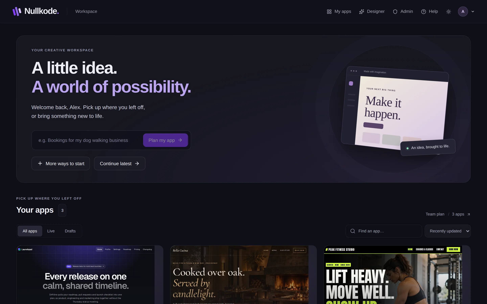
</p>

## See it in action

<table>
<tr>
<td width="33%" align="center"><a href="https://nullkode.com/videos/nullkode-quick-tour.mp4">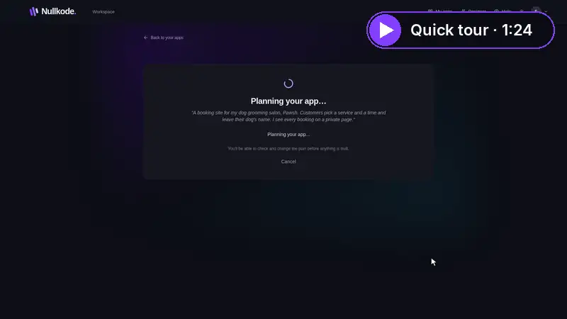</a><br><b>Quick tour</b> (1:24) · <a href="https://nullkode.com/videos/download/nullkode-quick-tour.mp4">Download</a><br>Describe a booking app, check the plan, watch it build, change it with AI, publish.</td>
<td width="33%" align="center"><a href="https://nullkode.com/videos/nullkode-ai-designer.mp4">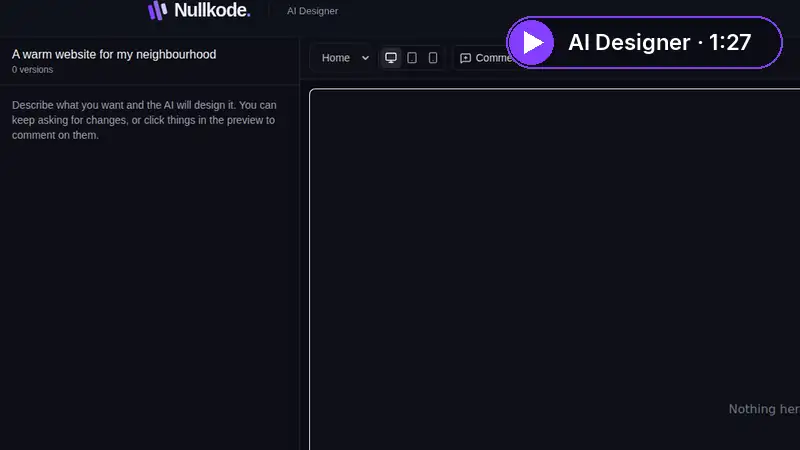</a><br><b>AI Designer</b> (1:27) · <a href="https://nullkode.com/videos/download/nullkode-ai-designer.mp4">Download</a><br>Design a whole website by talking: click anything to change it, every version saved.</td>
<td width="33%" align="center"><a href="https://nullkode.com/videos/nullkode-own-platform.mp4">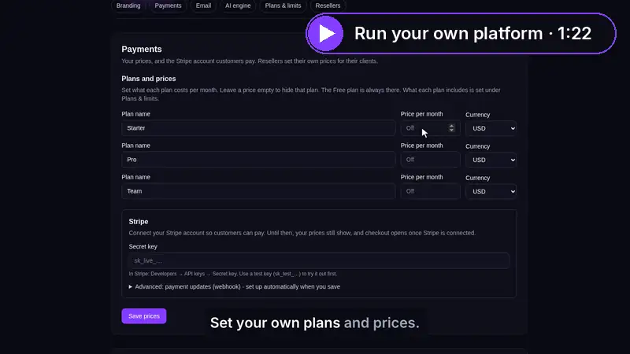</a><br><b>Run your own platform</b> (1:22) · <a href="https://nullkode.com/videos/download/nullkode-own-platform.mp4">Download</a><br>Your prices, your resellers, any AI, and your brand on everything.</td>
</tr>
</table>

<sub>Click a preview to watch the full video with sound, or <a href="https://nullkode.com/videos/download/nullkode-videos.zip">download all three</a> (25 MB). Music: Kevin MacLeod (incompetech.com), CC-BY 4.0.</sub>

---

## What you get

**A complete platform, not just a builder.** Accounts, plans, Stripe billing,
white-label branding, resellers, an admin control panel, publishing, custom
domains, automatic HTTPS and mobile app builds. It's all here, all MIT, with no
paid core and no license server.

- **Describe it, check the plan, launch it.** The AI shows you a plan first
  (pages, data, what each form does), you change what you like, then it builds
  the whole app.
- **Real backends, visually.** Every app gets its own Postgres database and a
  flow editor for the logic: forms, sign-in, bookings, payments, emails and
  schedules.
- **135 ready-made features.** Bookings, shops, memberships, CRM, reviews,
  forums, invoices, event tickets and more. Each one adds its own pages, tables
  and admin screens.
- **Make real games.** The Game Studio builds 2D and 3D games step by step on a
  live canvas, from a library of 63,000+ free (CC0) sprites, models, sounds and
  fonts that the AI has tagged and can search. Chat with it while it builds.
- **Ship everywhere.** Web, installable app, real native Android and iPhone apps
  (APK, Google Play, Xcode and TestFlight), plus Windows and Mac shortcuts.
- **18 languages.** The whole studio, plus apps in any language, or several at
  once with a language switcher. Right-to-left included.
- **An API for everything.** A partner API that lets your own tools and agents
  create, build and publish apps. See [docs/partner-api.md](docs/partner-api.md).
- **Run it as your business.** Your brand on everything. Agencies resell it
  under theirs, on their own domains, billing their own clients.
- **Any AI, including local.** OpenAI or any compatible service, or a model on
  your own server. Building a typical app costs a few cents.
- **Help where you need it.** Plain-English tips on every button and setting
  (switch them off in your Profile), and 18 step-by-step guides with screenshots.
  The Help link opens the guide for the screen you're on.

---

## Build

<table>
<tr>
<td width="50%">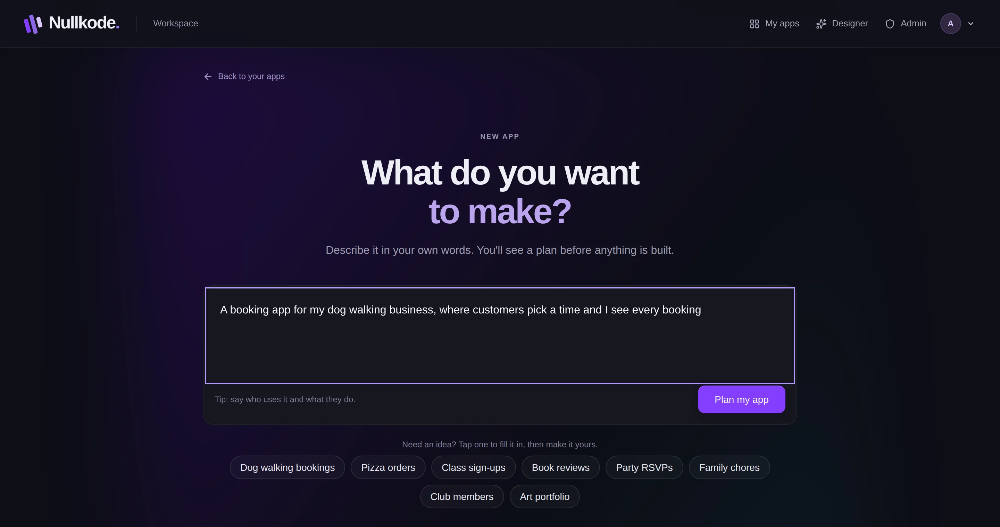<br><b>Describe it.</b> Plain words in, a plan out. Nothing is built until you approve it.</td>
<td width="50%">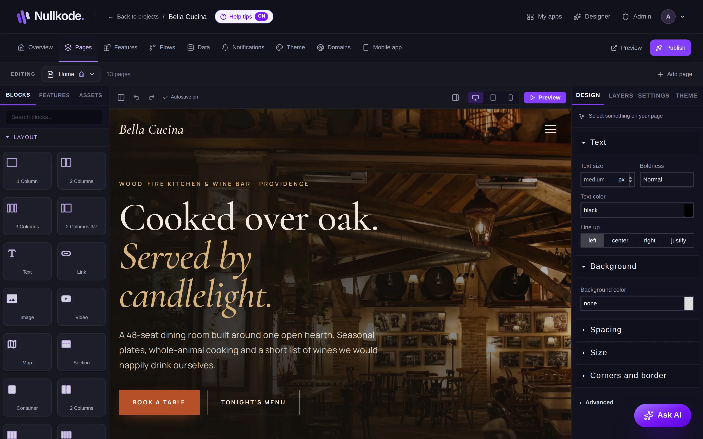<br><b>Edit visually.</b> Drag-and-drop editor with live data, plus "Ask AI" for any change.</td>
</tr>
<tr>
<td>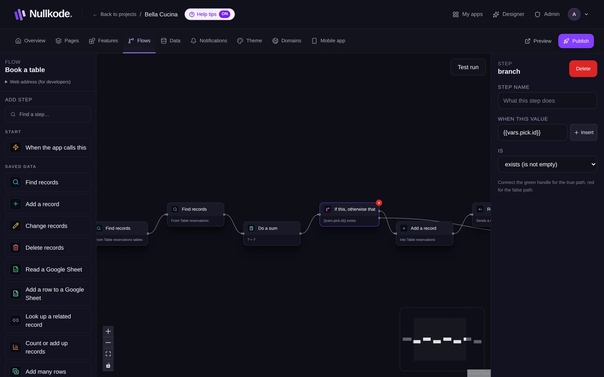<br><b>Logic without code.</b> Flows for forms, sign-in, bookings and branches, with test runs.</td>
<td>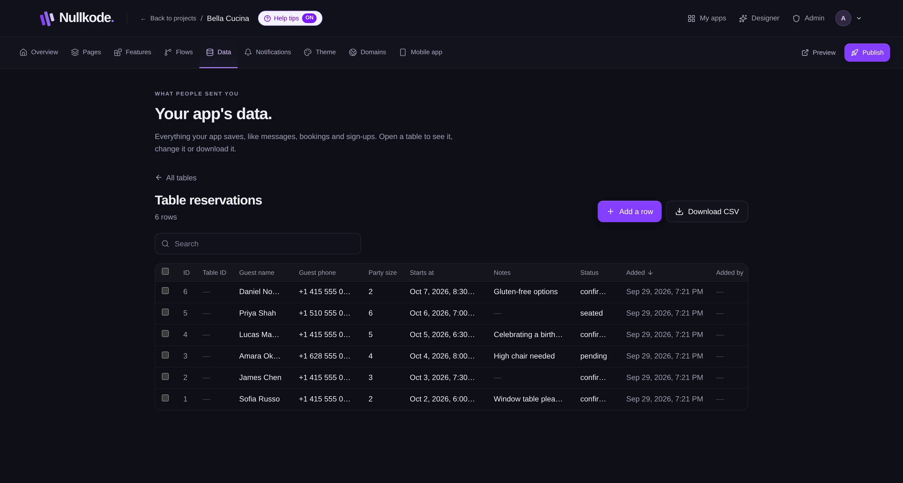<br><b>Your data.</b> Every app has a real database: search, edit, export to CSV.</td>
</tr>
<tr>
<td colspan="2">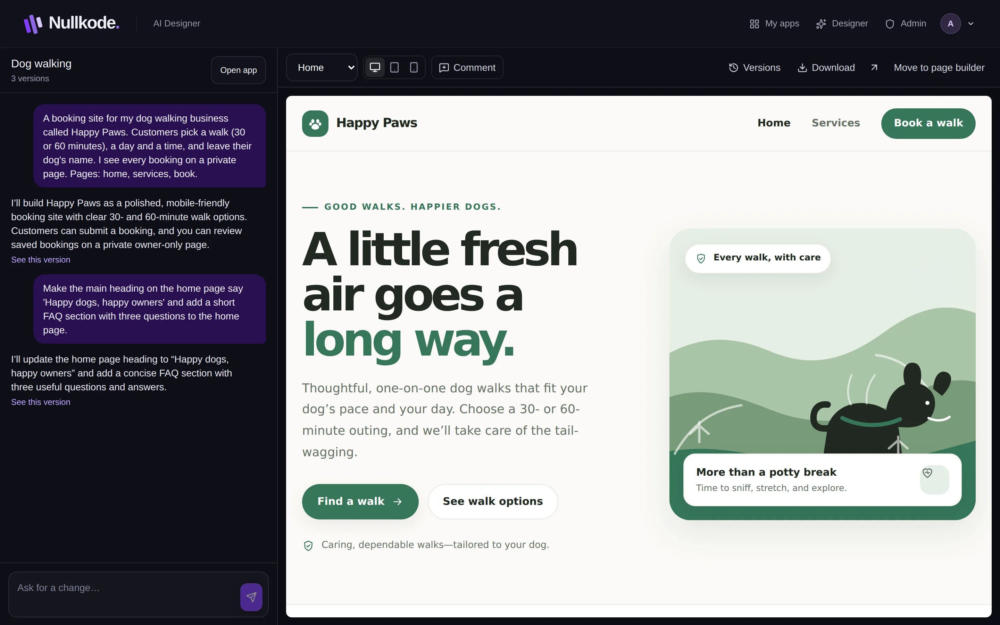<br><b>Or design it in a conversation.</b> The AI Designer builds a complete site with working forms and a private admin page, then keeps changing it as you talk. Click anything to comment, compare versions, restore, download. Runs on any OpenAI-compatible model, including open models on your own hardware.</td>
</tr>
<tr>
<td colspan="2">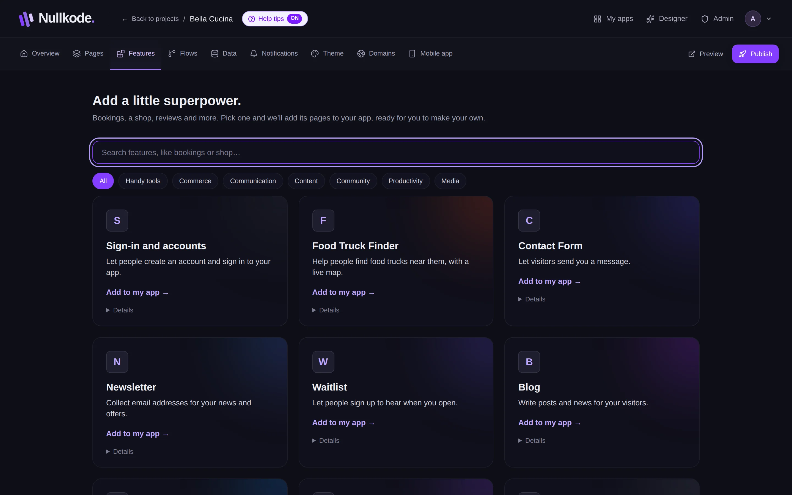<br><b>Add a superpower.</b> 135 features, one click each: bookings, shop, memberships, reviews, forums, tickets…</td>
</tr>
</table>

## Make games

Official NullKode games, on the same engine kits and asset library every Game
Studio project uses. These are real screenshots, and every game plays with a
mouse and keys or on a phone.

<table>
<tr>
<td colspan="2">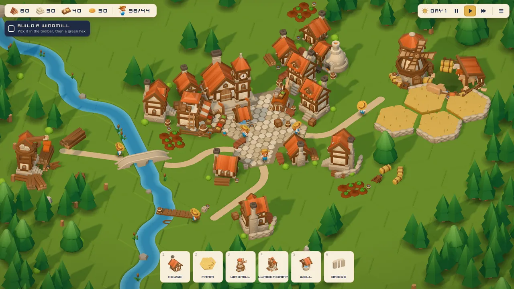<br><b>Hearthvale</b> · village builder. Grow a medieval village on a hex island: pick a building, see where it fits, place it. <a href="https://hearthvale-m920yo.apps.nullkode.io"><b>Play it</b></a></td>
</tr>
<tr>
<td width="50%">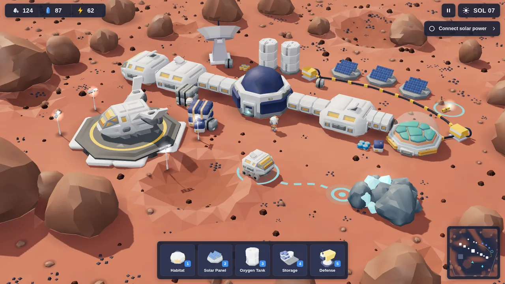<br><b>Red Horizon</b> · base builder. Power up a Mars colony, send the rover for crystals and shoot down meteors. <a href="https://red-horizon-q-nmxt.apps.nullkode.io"><b>Play it</b></a></td>
<td width="50%">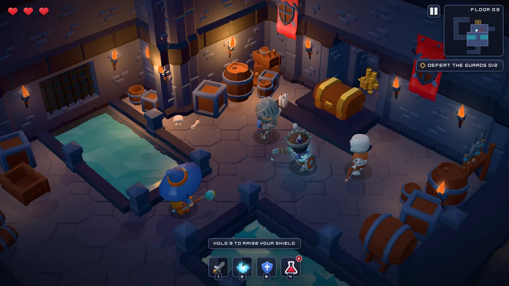<br><b>Vault of Embers</b> · dungeon action. Block the skeletons' telegraphed attacks, strike back and open the vault. <a href="https://vault-of-embers-tjene-e467c8.apps.nullkode.io"><b>Play it</b></a></td>
</tr>
</table>

**How the Game Studio works:** describe the game and the AI writes a short
plan, then builds it one step at a time while the canvas shows it growing. Keep
chatting while it works; your notes go into the next step. Every step is checked
in a headless browser and play-tested against a game-design playbook (feel,
readability, difficulty, phone controls), and every version can be restored.
2D games run on Phaser, 3D games on three.js with Rapier physics. Publish a game
and it becomes an app with its own address, like anything else you build.
Setup for self-hosters: [docs/games.md](docs/games.md).

## Publish everywhere

<table>
<tr>
<td width="62%">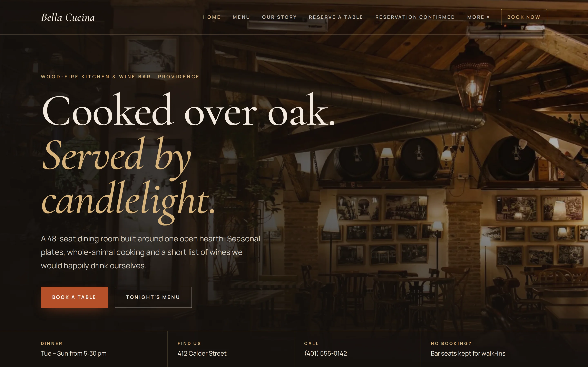<br><b>Every app gets its own address and HTTPS</b>, plus the owner's own domain if they want it.</td>
<td width="38%">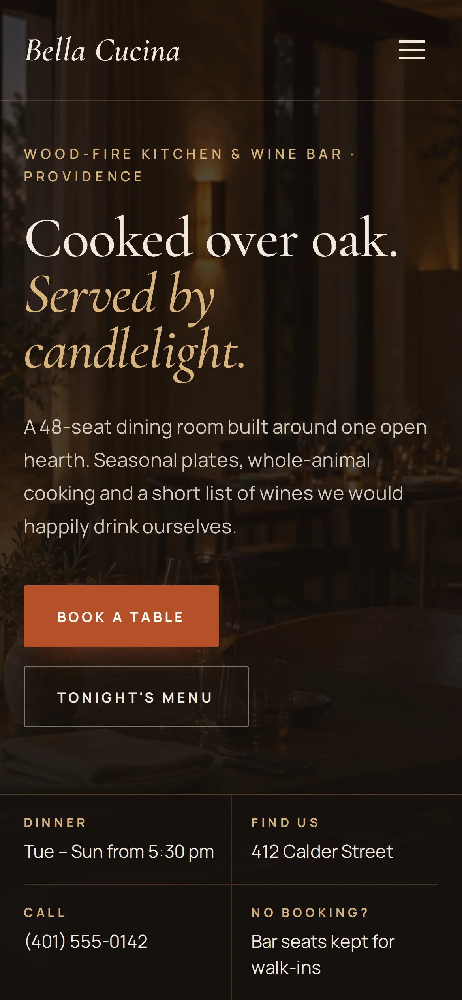<br><b>Looks right on phones</b>, and installs to the home screen.</td>
</tr>
<tr>
<td>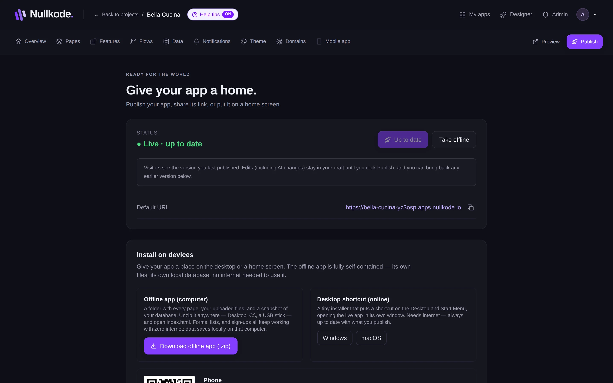<br><b>Safe publishing.</b> Visitors see the last published version; edits wait in a draft, and every version can be restored.</td>
<td>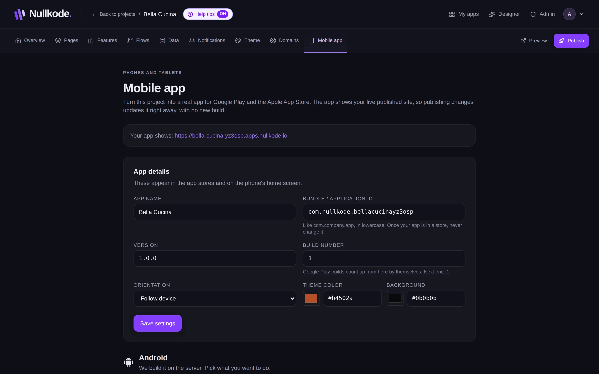<br><b>Android and iPhone apps</b> from the same project, built on your server.</td>
</tr>
</table>

## Run it as your business

<table>
<tr>
<td width="50%">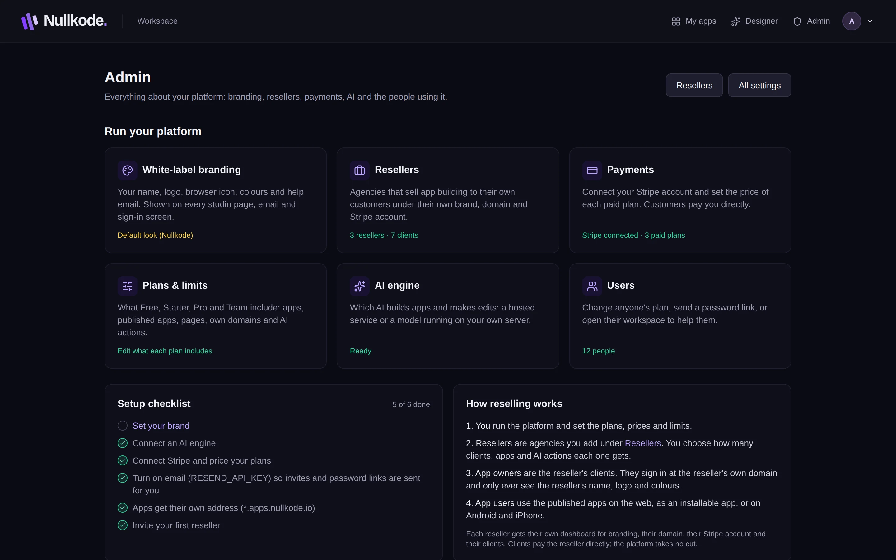<br><b>One control panel</b> for branding, resellers, payments, plans, AI and users, with a setup checklist.</td>
<td width="50%">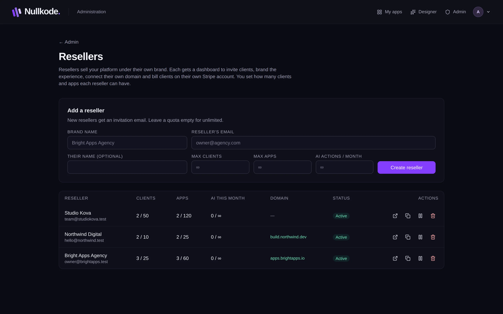<br><b>Resellers.</b> Agencies get their own dashboard, brand, domain, Stripe account and clients. You set their limits.</td>
</tr>
<tr>
<td>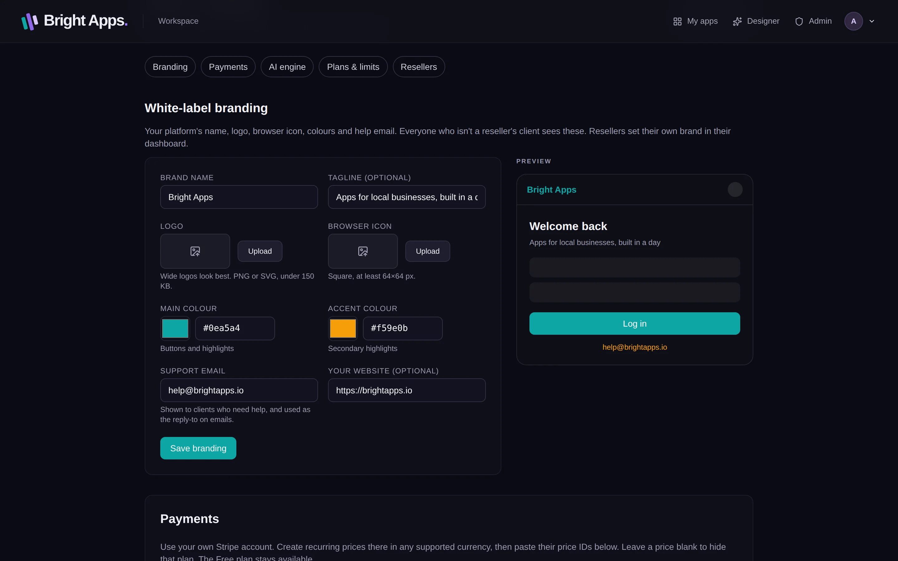<br><b>White label.</b> Your name, logo, colours and help email on every screen and email…</td>
<td>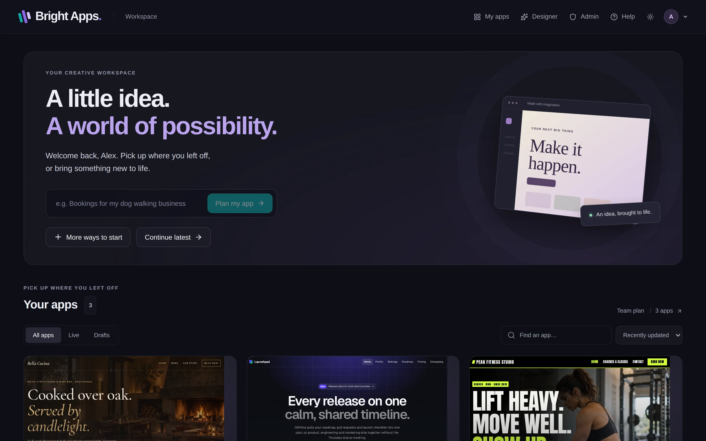<br>…and the whole platform is yours. Here it's "Bright Apps".</td>
</tr>
</table>

**Four levels, out of the box:** you run the platform → resellers sell it under
their brand → their clients build apps → app users use them. Clients pay
resellers directly on the reseller's own Stripe account. Set plans and prices in
the admin panel. See [docs/resellers.md](docs/resellers.md).

---

## Run it yourself in 5 minutes

You need [Docker](https://docs.docker.com/get-docker/). Then:

```bash
git clone https://github.com/drearystate/nullkode.git
cd nullkode
bash install.sh          # Windows: double-click Start-Nullkode.bat
```

Open **http://localhost:3001/install**, create your owner account, and you're
running. On a server with a domain, the installer sets up automatic HTTPS for
the studio, every app, and your customers' own domains. Step-by-step guide:
[docs/install.md](docs/install.md).

**Rather not run servers?** [nullkode.com](https://nullkode.com) is the hosted
version: nothing to install, and it's free.

## Original image library

The editor includes 172 original generated images across 82 business and lifestyle categories, with local thumbnails and subject search. Matching images are assigned to original-template photo slots; the full collection is searchable in Assets and ships with the source release. Browse `public/media/generated/index.html`; prompts and asset details are in [the image-library notes](docs/assets/GENERATED-IMAGES.md).

## Add features and templates

Two commands make a working starter and register it. One more checks it:

```bash
pnpm new:module "Pet Adoption"                  # a feature: pages + tables + backend
pnpm new:template "Coffee Shop" --category food # a template: design + theme + features
pnpm check:extensions                           # catches mistakes before anyone installs it
```

The guide is short: [docs/extending.md](docs/extending.md). New features and
templates are the easiest way to contribute.

---

## Everything in the box

| | |
|---|---|
| **Building** | AI plan-then-build, AI Designer, 18 original templates, website import, blank canvas, drag-and-drop editor, Ask AI edits, themes with dark mode |
| **Backend** | Postgres per app, visual flows, sign-in and roles, email, webhooks, Google Sheets, scheduled flows, AI steps |
| **Features** | 135 ready-made: commerce (32), utility (26), community (26), productivity (20), content (17), media (9), communication (5) |
| **Publishing** | Draft and live versions with rollback, own address per app, custom domains, automatic HTTPS, PWA and offline, push notifications, QR codes |
| **Mobile** | Real native iOS and Android apps compiled from your pages (React Native), previews in the browser, in Expo Go and in an Android emulator, Android APK and Google Play (AAB) with per-app signing keys, iOS Xcode project and TestFlight workflow |
| **Games** | Game Studio with a live step-by-step canvas, chat while it builds, 2D (Phaser) and 3D (three.js + Rapier) kits, 63k+ tagged CC0 assets with AI search, automatic play-testing, versions, phone controls, publish as an app |
| **Languages** | Studio in 18 languages with right-to-left support, apps in any language, multilingual apps with a language switcher |
| **API** | Partner API to create, build, change and publish apps from your own tools ([docs](docs/partner-api.md)) |
| **Business** | Plans and limits, Stripe billing, white-label, resellers with their own Stripe and domains, admin panel, user impersonation for support |
| **Security** | Owner-only admin pages locked automatically, app data isolated per app, cross-site request blocking, sign-up spam protection, safe upload handling |
| **AI** | OpenAI or any compatible API, local models, AI usage limits per plan |

## For developers

Next.js 15 (App Router), React 19, Prisma and PostgreSQL, GrapesJS, pnpm
workspaces. Node 20+ and pnpm 10.

```bash
corepack enable
pnpm install --frozen-lockfile
cp .env.example .env     # set DATABASE_URL and random secrets
pnpm db:push
pnpm dev                 # http://localhost:3001/install
```

Checks: `pnpm typecheck`, `pnpm check:js`, `pnpm check:extensions`,
`pnpm test:e2e`. More: [architecture](docs/architecture.md),
[contributing](CONTRIBUTING.md), [local AI](docs/local-ai.md),
[mobile apps](docs/mobile-apps.md), [native apps](docs/native-apps.md), [games](docs/games.md),
[partner API](docs/partner-api.md), [deployment](docs/deploy/).

## License

MIT: use it, change it, sell it. See [LICENSE](LICENSE).
