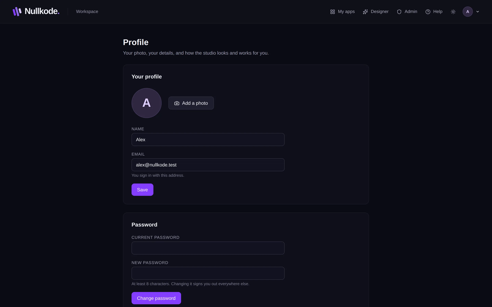
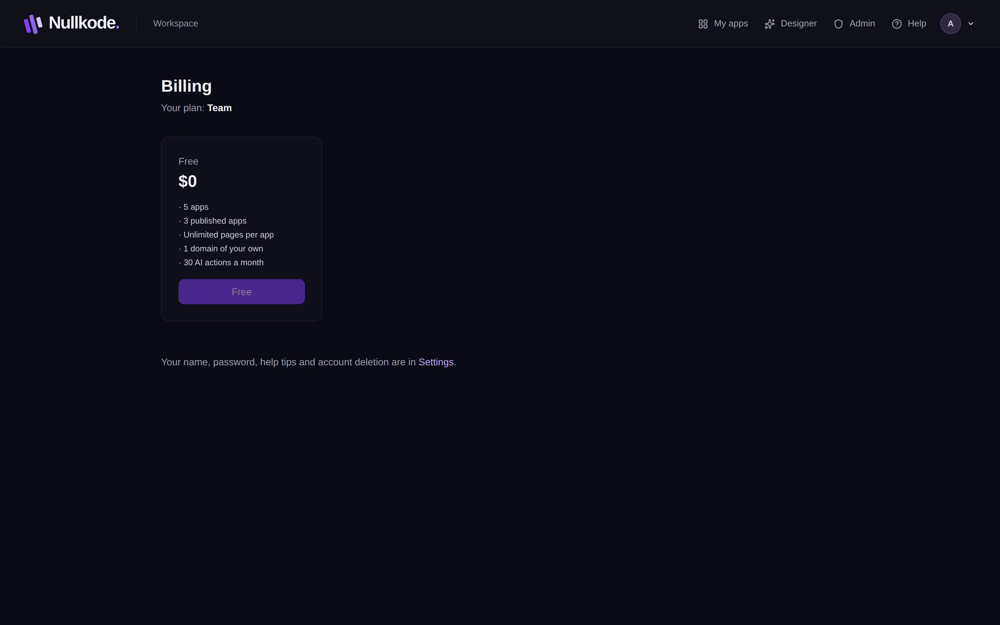

<!-- Generated from src/lib/help/guides.ts by `pnpm guides:build`. Edit that file, not this one. -->

# Your profile, plan and settings

Add a photo, change your name and password, choose light or dark, turn help tips on or off, check your plan and AI use, or delete your account.

**On this page**

- [Your photo, details and password](#your-photo-details-and-password)
- [Signed up with Google?](#signed-up-with-google)
- [Light or dark](#light-or-dark)
- [Help tips and guides](#help-tips-and-guides)
- [Your plan and AI use](#your-plan-and-ai-use)
- [Delete your account](#delete-your-account)
- [Good to know](#good-to-know)

## Your photo, details and password

1. Click your picture (or initial) at the top right, then **Profile**.
2. Press **Add a photo** and pick a picture of you. It's cropped to a square and shows next to your name. **Change photo** or **Remove** it any time.
3. Change your **Name** and press **Save**. Your email is the one you sign in with and can't be changed here.
4. Under **Password**, type your **Current password** and a **New password** of at least 8 characters, then press **Change password**. You're signed out on your other devices.

*Profile: your photo, name, password, light or dark, and help tips.*

## Signed up with Google?

If you don't know your current password, for example because you signed up with Google, sign out and use **Forgot password** on the sign-in page to set one.

## Light or dark

Press the sun or moon button in the top bar to switch between light and dark. In your **Profile**, under **Appearance**, you can also choose **Match my device**, which follows your computer or phone. Your choice is saved to your account, so it follows you to other devices.

## Help tips and guides

Help tips are short notes that appear when you hold your mouse over a button or setting. Turn them on or off in your **Profile** under **Help**. Inside an app, the **Help tips** button at the top does the same.

The **Help** link in the top bar opens the guide for the screen you're on. **Help & guides** in the account menu lists every guide.

## Your plan and AI use

Click your initial, then **Billing & plan**. It shows your plan and, if your plan has a monthly allowance, how many AI actions you've used this month. Planning, building and changing things with the AI all use AI actions.

When they run out, the AI pauses until next month. Templates and the page editor keep working. If other plans are offered, you can pick one on the same page. Once you pay for a plan, **Manage billing** lets you change your payment details.

*Billing & plan: your plan and this month's AI use.*

## Delete your account

This deletes your account and all your apps, with everything they saved, their files and their web addresses. It can't be undone.

1. Go to your **Profile** and find **Delete my account**.
2. Download a **Backup** of each app you might want later. If an app is on Google Play, download its **Google Play upload key** too.
3. Press **Delete my account…**.
4. Type your email address to confirm, and tick the upload key box if it's shown.
5. Press **Delete my account for good**.

## Good to know

- Changing your password signs you out everywhere else.
- A paid plan is cancelled straight away when you delete your account.
- If your account can't be deleted here, for example because you run a workspace for other people, your Profile page explains why.

## Related guides

- [Getting started](getting-started.md): Find your way around Nullkode and make your first app, whichever way suits you.
- [Publish and share your app](publishing.md): Put your app online, share its link, update it safely and bring back an earlier version if you need to.

[All guides](README.md)
