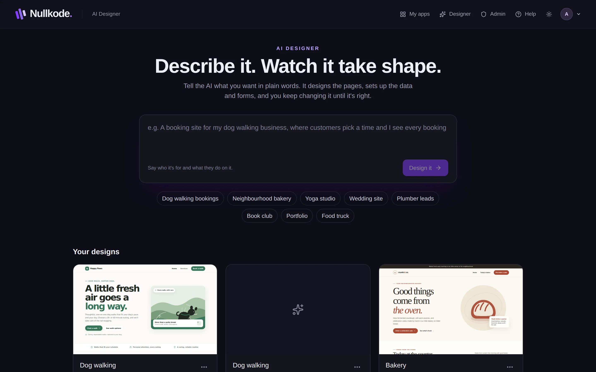
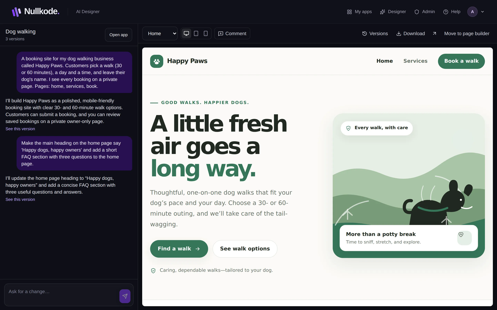
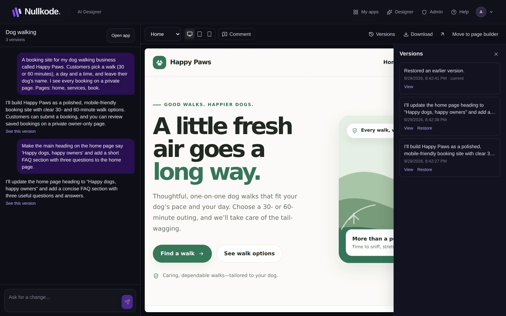

<!-- Generated from src/lib/help/guides.ts by `pnpm guides:build`. Edit that file, not this one. -->

# Design with the AI Designer

Describe your app in plain words, then shape it by chatting with the AI and clicking on what you want changed.

**On this page**

- [Start a design](#start-a-design)
- [Watch it build](#watch-it-build)
- [Ask for changes](#ask-for-changes)
- [Point at what you want changed](#point-at-what-you-want-changed)
- [Check every page and screen size](#check-every-page-and-screen-size)
- [Go back to an earlier version](#go-back-to-an-earlier-version)
- [Download it, or move it to the page builder](#download-it-or-move-it-to-the-page-builder)
- [Your designs](#your-designs)
- [Good to know](#good-to-know)

## Start a design

1. Click **Designer** in the top bar. On a phone, go to **More ways to start** on your dashboard and choose **Design it together**.
2. Under **What do you want to make?**, describe your app. Say who it's for and what visitors should be able to do, like book a time or send a message. You can also tap one of the example ideas and change it.
3. Press **Design it**.
4. The AI may ask **A few quick questions first**. Tap an answer, type your own, or skip any of them. Press **Build it**, or **Skip questions** to let the AI decide.

*Describe what you want, then press Design it.*

## Watch it build

While the AI works, the conversation on the left shows **Working on it…** with each step as it happens, and the preview on the right fills in. A first design can take a few minutes.

To stop part-way, press the square stop button next to the message box. Nothing from that run is kept.

Once the first build is done, your design has its own app. **Open app** at the top of the conversation takes you to it, where you'll find its data, flows and publishing.

## Ask for changes

1. Type what you want changed in the **Ask for a change** box, in your own words. For example: “make the header darker” or “add a page with our prices”.
2. Press Enter, or the send button. Shift+Enter starts a new line.
3. The AI updates the design and saves it as a new version.

*The conversation is on the left, the live preview on the right.*

## Point at what you want changed

Sometimes it's easier to show the AI than to describe it.

1. Press **Comment** above the preview. It changes to **Click anything to comment**.
2. Click the part of the preview you want changed.
3. Type what should change, for example “make this bigger”, and press **Add**. Your note waits above the message box.
4. Add as many notes as you like, then press send to make all the changes at once. To drop a note, press its x.

## Check every page and screen size

Use the **Page** menu above the preview to see each page of your design. The three screen buttons show it at computer, tablet and phone width. The arrow button opens the page on its own in a new tab.

On a phone, switch between **Conversation** and **Preview** at the top of the screen.

## Go back to an earlier version

Every change is saved as a version, so you can always go back.

1. Press **Versions**. Every version is listed, newest first.
2. Press **View** to show an older version in the preview. You can also press **See this version** under a message in the conversation.
3. Press **Restore** (or **Restore it** in the yellow bar) to make that version the current one. The version you had stays in the list, so you can switch back.
4. To stop looking at an old version, press **Back to the current version**.

*Versions: look at any earlier version and bring it back.*

## Download it, or move it to the page builder

**Download** saves every page of your design as one .zip file.

**Move to page builder** hands the app over to the drag-and-drop page editor. After that the AI Designer can't change it any more. If you want to keep designing with the AI, press **Make a copy to keep designing**: you get a separate copy, and the app in the page builder stays as it is.

## Your designs

The Designer home lists **Your designs**. Click a card to open one. The **…** button on a card lets you **Rename**, **Make a copy** or **Delete** it.

Deleting a design also deletes its app, unless the app was moved to the page builder. It can't be undone.

## Good to know

- Asking the AI for a design or a change uses your plan's monthly AI allowance, if it has one.
- In a Designer app, the pages come from the design. Change them here, not in the page editor.
- Your app's data, flows, domains and publishing are on its tabs, the same as any other app. Publish it with the **Publish** button.

## Related guides

- [Getting started](getting-started.md): Find your way around Nullkode and make your first app, whichever way suits you.
- [Publish and share your app](publishing.md): Put your app online, share its link, update it safely and bring back an earlier version if you need to.
- [Edit your pages](page-editor.md): Change words, pictures and layout by clicking and dragging, or ask the AI to do it for you.

[All guides](README.md)
