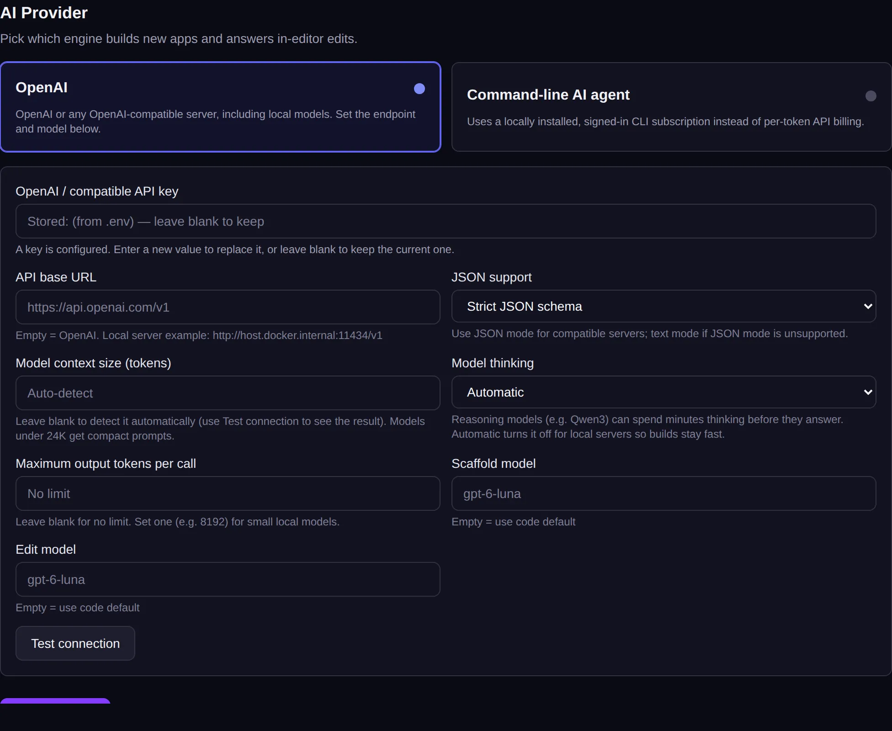

<!-- Generated from src/lib/help/guides.ts by `pnpm guides:build`. Edit that file, not this one. -->

# AI settings

Choose the AI engine that plans, builds and changes apps, and check that it works.

*For the platform's operator (admin).*

**On this page**

- [Where to find it](#where-to-find-it)
- [Choose a provider](#choose-a-provider)
- [Connect a hosted or compatible service](#connect-a-hosted-or-compatible-service)
- [Run the AI on your own hardware](#run-the-ai-on-your-own-hardware)
- [Use a command-line AI tool](#use-a-command-line-ai-tool)
- [Good to know](#good-to-know)

## Where to find it

In Admin, open **All settings** and go to **AI engine**. Until an engine is connected, building with AI is off: people start from templates and the page editor, and the AI Designer can't build.

## Choose a provider

There are two options:

- **OpenAI**: OpenAI's service, or any server that works the same way, including models running on your own hardware.
- **Command-line AI agent**: a command-line AI tool installed on this server, signed in with its own subscription, instead of paying per request.

*Pick a provider, fill in its details and test it.*

## Connect a hosted or compatible service

1. Choose **OpenAI**.
2. Paste your key into **OpenAI / compatible API key**. If a key is already stored, leave the box empty to keep it.
3. Leave **API base URL** empty for OpenAI's own service, or type the address of a compatible server.
4. Type the model names under **Scaffold model** (plans and builds new apps) and **Edit model** (changes in the editor), or leave them empty for the defaults.
5. Press **Test connection**. It saves your settings first, then shows **OK** or **Failed** with the reason.
6. Press **Save changes**.

## Run the AI on your own hardware

Any model server that speaks the same language as OpenAI's service works, such as Ollama, LM Studio, vLLM or llama.cpp's server. Put its address in **API base URL** (for a model on the same computer as Nullkode's Docker containers, something like http://host.docker.internal:11434/v1), leave the key empty unless the server needs one, and type the model's exact name.

Leave **Model context size** and **Maximum output tokens per call** empty, and **Model thinking** on **Automatic**: Nullkode works out sensible values. If tests or builds say the answer was unreadable, set **JSON support** to **Prompt only**.

Speed depends on your hardware. Bigger models write better pages; try building a sample app before you invite people.

## Use a command-line AI tool

1. Install the tool on this server and sign it in, as the account that runs Nullkode (or its dedicated runner account).
2. Choose **Command-line AI agent**.
3. Set **Model** if you want a different one, and **Binary path** only if the tool isn't found by itself.
4. Press **Test the AI agent**, then **Save changes**.

## Good to know

- Every plan, build and change uses AI actions from the person's monthly allowance (see **Plans & limits**), and a reseller's clients share the reseller's monthly limit.
- Stored keys are never shown again, only a masked hint.
- A key in the server's .env file (OPENAI_API_KEY) is used when none is saved here.
- The runbook in the download (docs/local-ai.md) has more on running models yourself.

## Related guides

- [Running your platform](running-your-platform.md): Your admin home: set up Nullkode, look after the people using it, and keep the server healthy.
- [Email](email.md): Send invitations, password links, app alerts and your apps' own emails from your own address.

[All guides](README.md)
