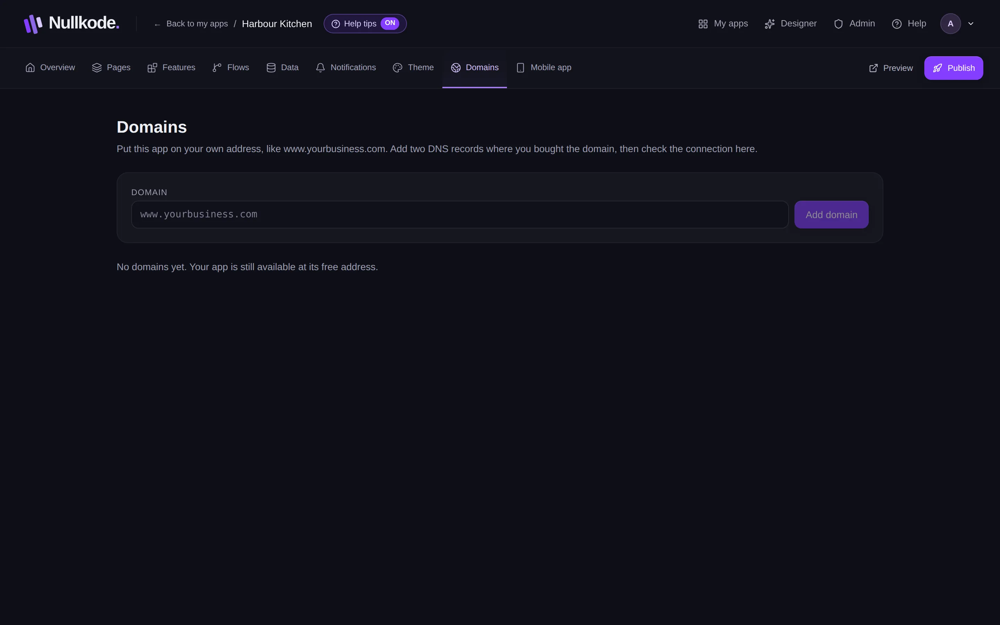

<!-- Generated from src/lib/help/guides.ts by `pnpm guides:build`. Edit that file, not this one. -->

# Use your own domain

Put your app on a web address you own, like www.yourbusiness.com.

**On this page**

- [Before you start](#before-you-start)
- [Connect your domain](#connect-your-domain)
- [If it doesn't connect yet](#if-it-doesnt-connect-yet)
- [Disconnect a domain](#disconnect-a-domain)
- [Good to know](#good-to-know)

## Before you start

You need a domain name you've bought from a domain company, and a way to change its DNS settings. DNS is the address book of the internet: two entries there tell it that your domain belongs to your app. Your domain company's website has a page for it, often called DNS, DNS records or zone.

Your app keeps its free address too.

## Connect your domain

1. Open the **Domains** tab.
2. Type your address, for example www.yourbusiness.com (without https://), and press **Add domain**.
3. You'll see two records to add: a CNAME (or A) record and a TXT record. Each has a **Name / host** and a **Value / points to**. Click a value to copy it.
4. In another tab, sign in to your domain company, open the DNS settings for your domain, and add both records exactly as shown.
5. Come back and press **Check now**. When both records are found, it says **Connected**, and visitors can use your address.

*Add your domain, then copy the two records to your domain company.*

## If it doesn't connect yet

- DNS changes usually show up within minutes, but can take a few hours. Press **Check now** again later.
- The check says which record it can't find yet: the TXT record, or the one that points your domain here.
- Some domain companies add your domain to the end of the name by themselves. If yours does, type only the first part of the name, like www or _verify.www.
- For an address without www (yourbusiness.com), some domain companies don't allow a CNAME record. Use an A record pointing to this server's IP address instead; ask whoever runs Nullkode for you for the address.

## Disconnect a domain

Press the bin next to the domain and confirm. Your app stays at its free address.

## Good to know

- A domain can only be connected to one app.
- Your plan may limit how many domains you can connect.
- Visitors see your published app at your domain, so publish before you share it.

## Related guides

- [Publish and share your app](publishing.md): Put your app online, share its link, update it safely and bring back an earlier version if you need to.
- [Phone apps and notifications](phone-apps.md): Put your app on people's home screens, send them notifications, and build Android and iPhone versions.

[All guides](README.md)
