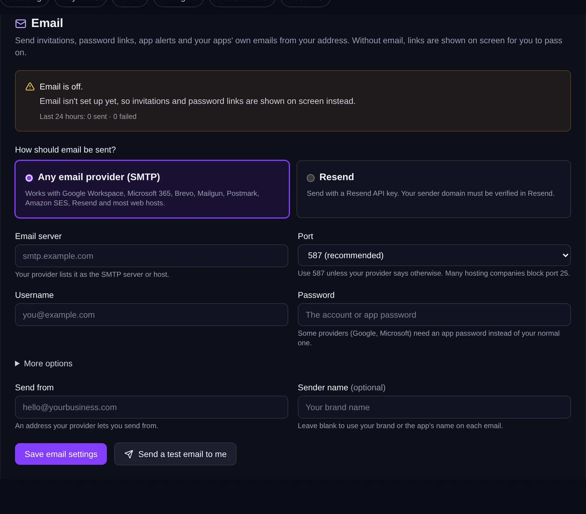

<!-- Generated from src/lib/help/guides.ts by `pnpm guides:build`. Edit that file, not this one. -->

# Email

Send invitations, password links, app alerts and your apps' own emails from your own address.

*For the platform's operator (admin).*

**On this page**

- [What email is used for](#what-email-is-used-for)
- [Set it up with any email provider](#set-it-up-with-any-email-provider)
- [Or use Resend](#or-use-resend)
- [Check it's working](#check-its-working)
- [When the test fails](#when-the-test-fails)
- [Good to know](#good-to-know)

## What email is used for

Once email is set up, Nullkode sends password links and invitations (for you, resellers and their clients), alerts to app owners when someone sends a form or books, and the emails apps send themselves with the **Send an email** step.

Without it, invitation and password links are shown on screen for you to pass on, and apps skip their email steps. App owners see a note about it on their app's Overview.

## Set it up with any email provider

1. In Admin, open **All settings** and go to **Email**.
2. Under **How should email be sent?**, choose **Any email provider (SMTP)**.
3. Type the **Email server** your provider gives you, like smtp.example.com.
4. Choose the **Port**. Use **587 (recommended)** unless your provider says otherwise.
5. Type the **Username** and **Password**. Google and Microsoft need an app password, not your normal one.
6. Type the address to **Send from**, one your provider lets you send from, and a **Sender name** if you like. Leave the name empty to use your brand's or the app's name.
7. Press **Send a test email to me**. It uses what's on screen, so you can check before saving.
8. Press **Save email settings**.

*Fill in your provider's details and send yourself a test.*

## Or use Resend

Choose **Resend**, paste your **Resend API key**, and send from an address on a domain you've verified in Resend. Then test and save as above.

## Check it's working

The box at the top says **Email is on** with the address it sends from, and shows the last 24 hours: how many were sent and failed, and the last problem, if any. The Email card on the System page shows the same.

## When the test fails

- **Username or password rejected**: check both. Google and Microsoft need an app password; email services often give you an SMTP key instead of your account password.
- **Couldn't reach the server on that port**: try 587, then 465, then 2525, or ask your host to open the port.
- **The port and encryption don't match**: use 465 with SSL, or 587 with automatic encryption (under **More options**).
- **Refused to send from that address**: your provider hasn't verified that sender or its domain. Verify it, or send from an address it knows.
- **Resend's test mode**: a new Resend account only emails its own address until you verify a domain.

## Good to know

- Every email is sent from your **Send from** address. When an app asks to send from an address on another domain, its address becomes the reply-to, so replies still reach the app owner.
- Settings in the server's .env file are used until you save here; saving here takes over.
- **Remove these settings** goes back to no email (or to the .env settings, if there are any).
- The support email in your branding is the reply-to on invitation and password emails.

## Related guides

- [Running your platform](running-your-platform.md): Your admin home: set up Nullkode, look after the people using it, and keep the server healthy.
- [Your brand (white-label)](white-label.md): Put your own name, logo and colours on the studio, its emails and its sign-in pages.

[All guides](README.md)
