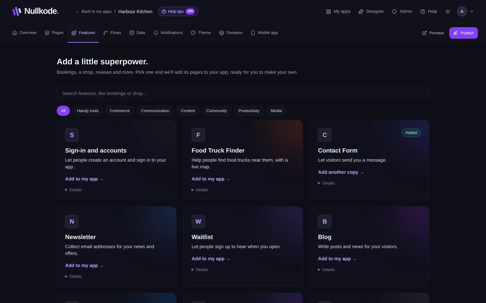
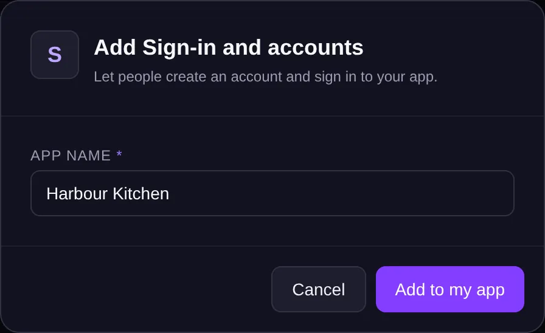

<!-- Generated from src/lib/help/guides.ts by `pnpm guides:build`. Edit that file, not this one. -->

# Add features

Add ready-made parts like bookings, a shop or a blog, complete with their own pages and saved data.

**On this page**

- [What a feature is](#what-a-feature-is)
- [Add a feature](#add-a-feature)
- [Add a feature while editing](#add-a-feature-while-editing)
- [Where to find what it added](#where-to-find-what-it-added)
- [Good to know](#good-to-know)

## What a feature is

A feature is a ready-made part of an app, like bookings, a shop, a contact form or a blog. Adding one gives your app new pages, the lists where it keeps what people send, and the flows that make its buttons and forms work. You can then change its pages like any other page.

## Add a feature

1. Open the **Features** tab.
2. Search, for example “bookings” or “shop”, or pick a group like Commerce or Community.
3. To see what a feature adds, open **Details** on its card. It says how many pages, lists of saved items and flows it adds.
4. Click the card (**Add to my app**).
5. Answer its few questions, if it has any. Fields marked * must be filled in. Your app's name is filled in for you where it asks for a business name.
6. Press **Add to my app**. The editor opens on the feature's first page.

*Pick a feature. Details shows what it adds.*

## Add a feature while editing

In the page editor, the **Features** tab on the left does the same thing. When the feature is added, a message says its pages are in the menu, with a button to **Open the new page**.

*Answer a couple of questions and the feature is added.*

## Where to find what it added

Its pages are in your app's menu and in the page list in the editor. What it saves (for example bookings) is on the **Data** tab. Its flows are on the **Flows** tab. Pages meant only for you, like a list of bookings, are listed on the Overview under **Your app's admin area**.

## Good to know

- A card marked **Added** is already in your app. Adding it again makes another copy, with its own pages and lists.
- If a feature needs another one first, the message offers a button to add that one.
- Some features send email, and say **Needs email to be set up on the server**. If email isn't set up, ask whoever runs Nullkode for you.
- There's no one-step remove. You can delete the pages a feature added, like any page; what it saved stays on the Data tab.
- Adding a feature changes your draft. Visitors see it after you publish.

## Related guides

- [Edit your pages](page-editor.md): Change words, pictures and layout by clicking and dragging, or ask the AI to do it for you.
- [Forms and your data](forms-and-data.md): See, search, change and download everything your app saves, like messages, bookings and sign-ups.
- [Automate with flows](flows.md): Make things happen by themselves when someone uses your app, like saving a booking and emailing you, or run jobs on a schedule.

[All guides](README.md)
