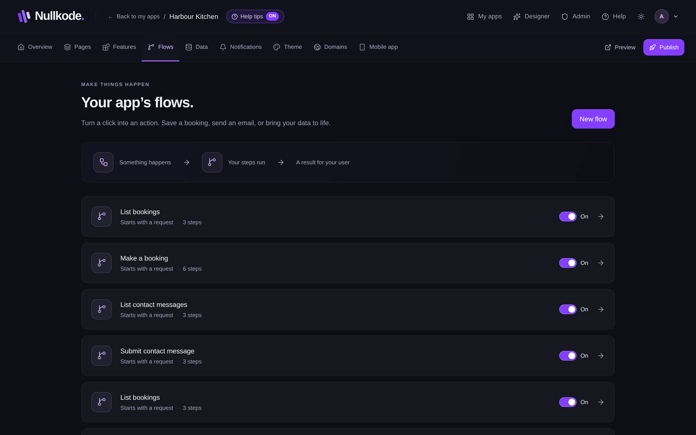
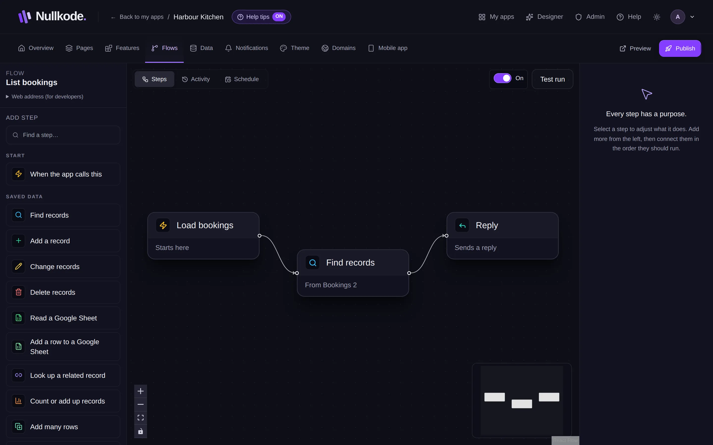
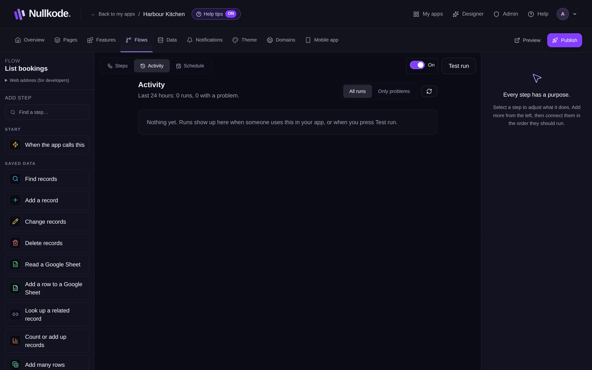

<!-- Generated from src/lib/help/guides.ts by `pnpm guides:build`. Edit that file, not this one. -->

# Automate with flows

Make things happen by themselves when someone uses your app, like saving a booking and emailing you, or run jobs on a schedule.

**On this page**

- [What a flow is](#what-a-flow-is)
- [Your flows](#your-flows)
- [Make a flow](#make-a-flow)
- [Use what people typed](#use-what-people-typed)
- [Connect a form or button](#connect-a-form-or-button)
- [Common recipes](#common-recipes)
- [Try it with a test run](#try-it-with-a-test-run)
- [See what happened](#see-what-happened)
- [Run it on a schedule](#run-it-on-a-schedule)
- [Good to know](#good-to-know)

## What a flow is

A flow is a short list of steps your app follows by itself. Something happens (someone sends a form or presses a button, or it's a set time), your steps run (save the answers, send an email), and your visitor gets a result (a thank-you message).

Apps the AI builds, and features you add, come with their flows already set up. You can open and change them like any flow.

## Your flows

The **Flows** tab lists each flow with how it starts (with a form, with a request, or on a schedule) and how many steps it has. Click one to open it.

Each flow has an **On** / **Paused** switch, on the list and inside the flow. A paused flow doesn't run: anything in your app that uses it, like a form, gets an error instead. Pausing and turning back on apply to your live app straight away, with no need to publish.

*Your app's flows.*

## Make a flow

1. On the Flows tab, press **New flow**, type a name like “Submit contact form” and press **Create**.
2. The flow opens with its start step, **When the app calls this**.
3. Under **Add step** on the left, click a step to add it. Type in **Find a step…** to search. Steps are grouped: Start, Saved data, Decisions and values, Send and connect, AI, Accounts and Finish.
4. Connect the steps in the order they should run: drag from the right edge of one step to the next step.
5. Click a step to set it up in the panel on the right, for example which table to save to.
6. Your changes save by themselves.

*Add steps on the left, connect them, and set each one up on the right.*

## Use what people typed

Most step settings let you insert values instead of typing fixed text. Under **From the request**, type the name of a form field, like email, and press **Add**. **From previous steps** lists values that earlier steps made, like the record a step found.

## Connect a form or button

1. Open the page in the page editor and select the form or button.
2. Open **Settings** on the right.
3. For a form, choose your flow under **When sent, run**. For a button, use **When pressed, run**. For a list, **Show items from** picks a flow that finds the items.

## Common recipes

These are the usual shapes. Features set most of them up for you.

- **Contact form that emails you**: When the app calls this, then **Add a record** (your messages table), then **Send an email** to yourself with the person's message inserted, then **Reply** with a thank-you.
- **Booking**: When the app calls this, then **Count or add up records** to count bookings at that time, then **If this, otherwise that**. If the time is free, **Add a record** and **Send an email** to confirm; if not, **Reply** that it's taken. The Bookings feature does all this for you.
- **Sign-in**: the Sign-in and accounts feature adds these flows. Signing up uses **Protect a password**, **Add a record** and **Sign the person in**. Signing in uses **Find records**, **Check a password** and **Sign the person in**.
- **Daily summary**: on the **Schedule** tab choose **On a schedule** and **Every day**, then **Count or add up records** and **Send an email** with the total.

## Try it with a test run

Press **Test run** to run the flow once, straight away, with your latest changes. The result shows under the steps. It really does its steps, so it saves records and sends emails, and it appears in Activity.

## See what happened

The **Activity** tab lists each time the flow ran: **Went through**, **Answered**, **Finished with a problem** or **Failed**. Press **Only problems** to see just the ones that went wrong, and open a run to see what the person sent.

Problems also show on your app's Overview under **Problems in the last 24 hours**, and as a number on the app's card on your dashboard.

*Activity: every run, and what went wrong if something did.*

## Run it on a schedule

1. Open the flow's **Schedule** tab.
2. Choose **On a schedule** instead of **When your app uses it**.
3. Under **How often**, pick **Every few minutes**, **Every hour**, **Every day**, **Monday to Friday** or **Once a week**, then the time and your time zone.
4. Save, then publish your app. Schedules only run in the published app.

## Good to know

- To remove a step, select it and press its bin, or press Delete on your keyboard.
- Flow changes are part of your draft. Visitors get them after you publish.
- **Send an email** only sends when email is set up on the server. If it isn't, your app's Overview warns you.
- The **Ask AI** step uses your plan's AI allowance each time it runs.
- If you publish while a scheduled flow is paused, publish again after turning it back on.
- Some plans don't include scheduled flows. The Schedule tab says so.
- **Web address (for developers)** is only needed to start a flow from outside Nullkode.

## Related guides

- [Forms and your data](forms-and-data.md): See, search, change and download everything your app saves, like messages, bookings and sign-ups.
- [Members, sign-in and private pages](members-and-sign-in.md): Let people make accounts in your app, and choose which pages everyone, signed-in members or only admins can open.
- [Publish and share your app](publishing.md): Put your app online, share its link, update it safely and bring back an earlier version if you need to.

[All guides](README.md)
