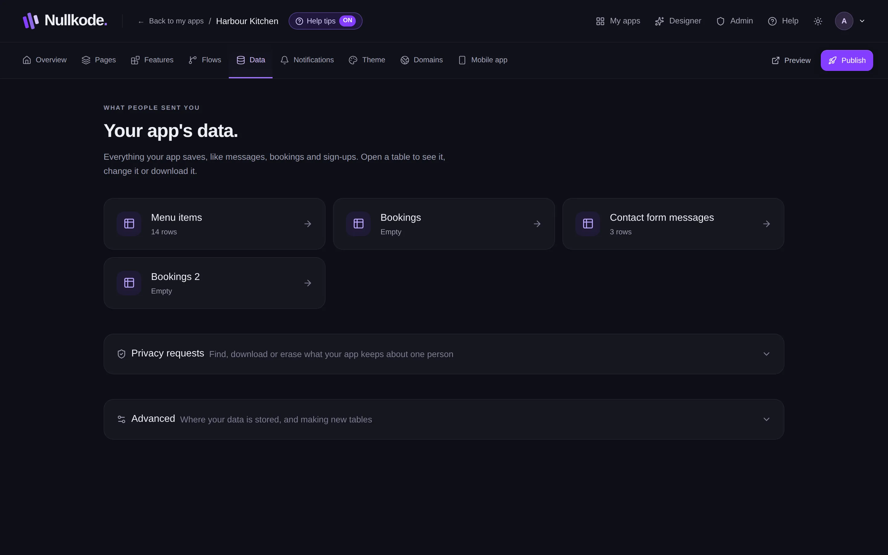
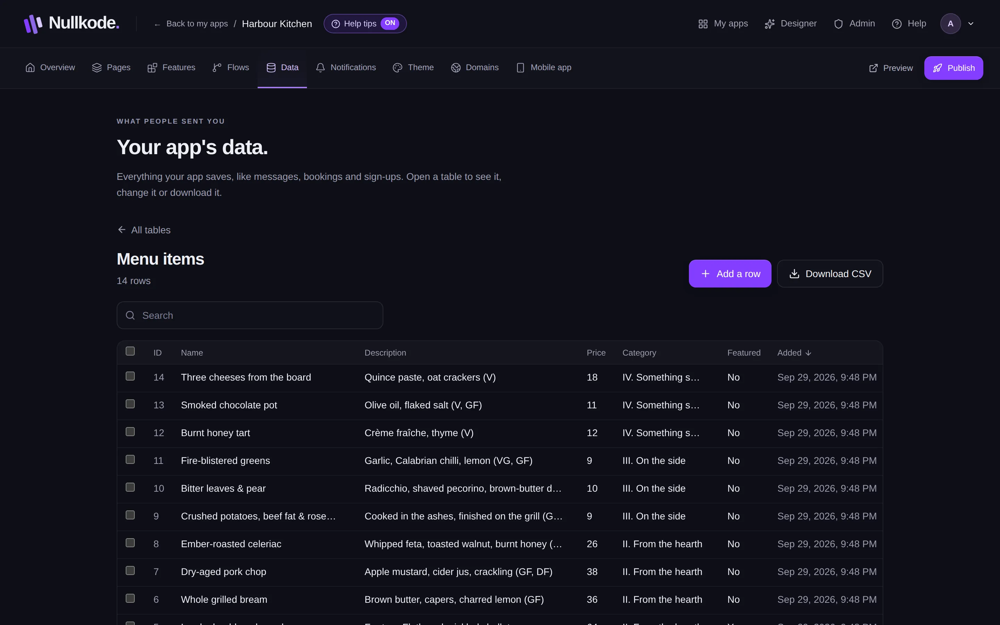

<!-- Generated from src/lib/help/guides.ts by `pnpm guides:build`. Edit that file, not this one. -->

# Forms and your data

See, search, change and download everything your app saves, like messages, bookings and sign-ups.

**On this page**

- [Where form answers go](#where-form-answers-go)
- [Open a table](#open-a-table)
- [Find, change and add rows](#find-change-and-add-rows)
- [Download a copy](#download-a-copy)
- [Get an email for every new entry](#get-an-email-for-every-new-entry)
- [Privacy requests](#privacy-requests)
- [Good to know](#good-to-know)

## Where form answers go

When someone sends a form, makes a booking or signs up, your app saves it as a row in a table. A table is like a spreadsheet: one row for each entry and one column for each answer. Tables are on the **Data** tab. The five newest entries also show on your app's Overview under **Latest submissions**.

A form saves answers when it's connected to a flow that saves them. Forms that come with features, and forms in apps the AI builds, are already connected. For a form you add yourself, select it in the page editor, open **Settings** and choose a flow under **When sent, run**.

## Open a table

1. Open the **Data** tab.
2. Click a table. Each one shows how many rows it has, or **Empty**.
3. To go back to the list, press **All tables**.

*Everything your app saves, one table at a time.*

## Find, change and add rows

Type in **Search** to find rows. Click a column's name to sort by it. When there are lots of rows, use **Newer** and **Older** at the bottom.

1. To change one answer, click it, type the new value and save.
2. To change a whole row, press the pencil at the end of it.
3. To add a row yourself, press **Add a row**.
4. To delete rows, tick them, press **Delete** (it says how many rows) and then **Yes, delete**. Press **Keep them** if you change your mind.

*A table: search it, change it, or download it.*

## Download a copy

**Download CSV** saves the table as a file you can open in Excel, Numbers or Google Sheets. It downloads what you're looking at, so search or sort first if you only want some rows.

## Get an email for every new entry

On your app's Overview, **Alerts** lists each table that collects things from visitors, with an On and Off switch. Alerts go to your account's email address, and you can add up to three more under **Also send to**. Press **Save alerts**, then **Send a test** to check it works.

Alerts need email to be set up on the server. If it isn't, the card says so.

## Privacy requests

People can ask what your app keeps about them, or ask for it to be deleted. Open **Privacy requests** on the Data tab to find one person by email or phone number, then **Download a copy** of their data or **Erase** it. People who asked to delete their account from your app are listed under **Waiting for your approval**.

## Good to know

- Deleting rows or erasing a person can't be undone.
- Some tables can only be viewed here, for example ones kept in a Google Sheet.
- **Advanced**, at the bottom of the Data tab, shows where your data is stored and lets you make new tables by hand. Most people never need it.
- A backup from the Publish tab includes every table and row.

## Related guides

- [Automate with flows](flows.md): Make things happen by themselves when someone uses your app, like saving a booking and emailing you, or run jobs on a schedule.
- [Add features](features.md): Add ready-made parts like bookings, a shop or a blog, complete with their own pages and saved data.
- [Members, sign-in and private pages](members-and-sign-in.md): Let people make accounts in your app, and choose which pages everyone, signed-in members or only admins can open.

[All guides](README.md)
