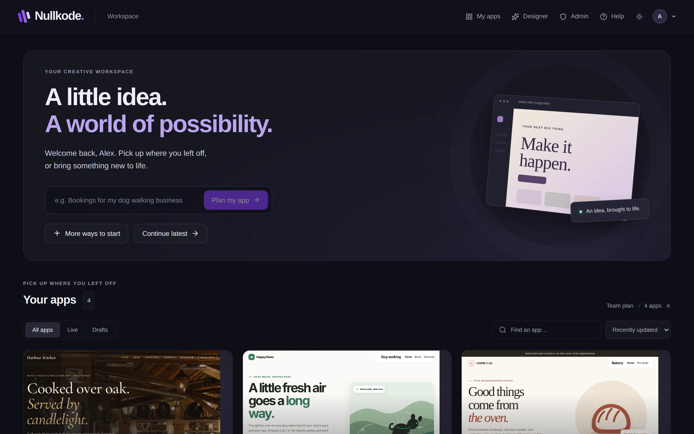
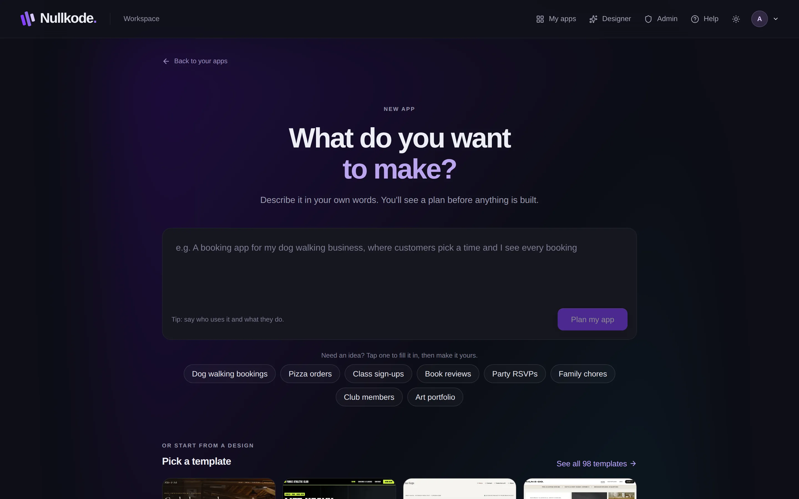
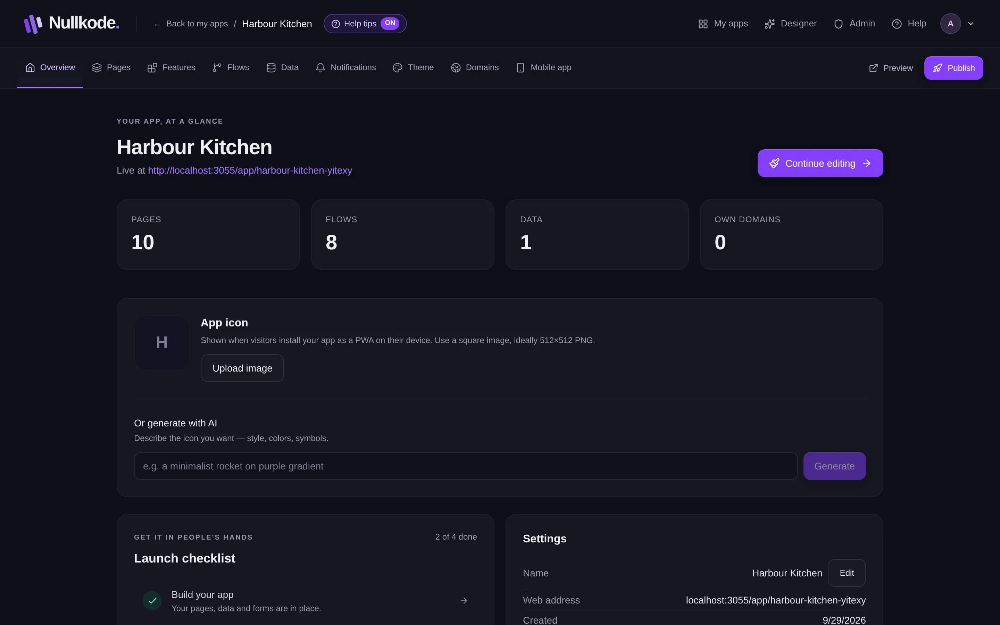

<!-- Generated from src/lib/help/guides.ts by `pnpm guides:build`. Edit that file, not this one. -->

# Getting started

Find your way around Nullkode and make your first app, whichever way suits you.

**On this page**

- [Your dashboard](#your-dashboard)
- [Six ways to start an app](#six-ways-to-start-an-app)
- [Describe your app and check the plan](#describe-your-app-and-check-the-plan)
- [The other ways to start](#the-other-ways-to-start)
- [Your app's Overview](#your-apps-overview)
- [Good to know](#good-to-know)

## Your dashboard

When you sign in you land on your dashboard. You can always get back to it with **My apps** in the top bar.

Under **Your apps**, each app has a card with a small picture of its home page, how many pages and flows it has, and whether it is **Live** (published) or a **Draft** (only you can see it). Use **All apps**, **Live** and **Drafts** and the **Find an app…** box to narrow the list.

Click the picture on a card to carry on editing. Click the app's name to open its Overview. The line beside **Your apps** shows your plan, how many apps you have, and how many AI actions you've used this month. Click it to open **Billing & plan**.

*Your dashboard. Each card is one of your apps.*

## Six ways to start an app

Pick whichever suits you. Every way ends with an app you can keep changing in the same tools.

- **Describe it.** Type what you want in your own words. The AI suggests a plan you can check and change, then builds the pages, forms and data.
- **AI Designer.** Chat with the AI and shape your app step by step. See the guide Design with the AI Designer.
- **Templates.** Start from a finished design, like a restaurant or a portfolio, and change every word, picture and colour.
- **Copy a website.** Bring up to 30 pages of a website you own into a new app you can edit.
- **Blank app.** Start with a simple page and build it yourself with drag-and-drop blocks.
- **Import an app.** Bring back an app from a backup .zip file, made on this server or another one.

## Describe your app and check the plan

If the AI isn't set up on this server, this way and the AI Designer aren't offered. Start from a template instead.

1. On your dashboard, type a sentence about your app in the box, for example “Bookings for my dog walking business”, and press **Plan my app**. You can also press **More ways to start** and use the big box there.
2. Say who uses the app and what they do in it. Stuck? Tap one of the example ideas under the box, then change it.
3. Wait a moment while the AI reads your idea. Nothing is built yet.
4. Check the plan under **Here's what I'll build**: the app's name, its look (click the colour swatch to pick another), its **Pages**, **What it saves** and **I assumed**. Remove a page you don't want with its bin icon.
5. Want something different? Type it under **Want something different?**, for example “Add a prices page”, and press **Update plan**.
6. Press **Build my app**. It usually takes a few minutes. You can leave the page: the build keeps going and will be there when you come back.
7. When it's ready, your app opens in the page editor with a short welcome.

*Describe your app in your own words. You see a plan before anything is built.*

## The other ways to start

**Templates.** Click a template to see it bigger, type a name for your app and press **Create app from this template**. Use the search box and the category buttons to narrow the list.

**Copy a website.** Type the site's address, for example mybusiness.com, and press **Copy my site**. Only copy sites you own or have permission to use. Press **Stop** to cancel; nothing is saved.

**Blank app.** Type a name and press **Create app**. You get a simple welcome page with your app's name to build on, plus pages for signing in and signing up.

**Import an app.** Choose the backup .zip file, type a new name if you like, and press **Import app**. You get a copy with its pages, flows, data and pictures. Passwords of the app's own members aren't in backups, so they use Forgot password once.

## Your app's Overview

Each app has tabs along the top: **Overview**, **Pages**, **Features**, **Flows**, **Data**, **Notifications**, **Theme**, **Domains** and **Mobile app**, with **Preview** and **Publish** on the right. Apps made with the AI Designer have a **Designer** tab instead of Overview.

The Overview shows whether your app is live and its address, a **Launch checklist** of the next things to do, a code to scan to open it on your phone, your app icon, the latest things visitors sent you, and email alerts. **Continue editing** takes you back to your pages.

*The Overview: your app at a glance, with a checklist of next steps.*

## Good to know

- Your work saves as you go. There's no Save button in the page editor.
- Nothing is public until you publish. **Preview** lets you try your app first.
- To delete an app, use the bin icon on its card on the dashboard. Download a backup first: deleting can't be undone.
- Your plan may limit how many apps you can make. When you reach it, see **Billing & plan**.
- Hold your mouse over a button to see a short tip about it. You can turn tips off in **Settings**.

## Related guides

- [Design with the AI Designer](ai-designer.md): Describe your app in plain words, then shape it by chatting with the AI and clicking on what you want changed.
- [Edit your pages](page-editor.md): Change words, pictures and layout by clicking and dragging, or ask the AI to do it for you.
- [Add features](features.md): Add ready-made parts like bookings, a shop or a blog, complete with their own pages and saved data.
- [Publish and share your app](publishing.md): Put your app online, share its link, update it safely and bring back an earlier version if you need to.

[All guides](README.md)
