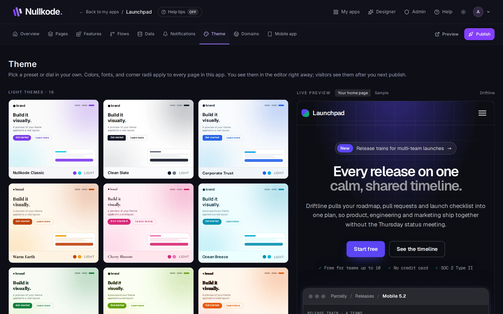

<!-- Generated from src/lib/help/guides.ts by `pnpm guides:build`. Edit that file, not this one. -->

# Colours and fonts

Pick a ready-made theme, or set your own colours, fonts and corners for every page of your app.

**On this page**

- [Pick a theme](#pick-a-theme)
- [Make it your own](#make-it-your-own)
- [Change it while you edit](#change-it-while-you-edit)
- [Good to know](#good-to-know)

## Pick a theme

1. Open the **Theme** tab.
2. Look through **Light themes** and **Dark themes**.
3. Click one. The **Live preview** on the right shows it straight away. Switch between **Your home page** and **Sample** to see it on different things.
4. That's it: changes save by themselves, and **Saved** appears at the top.

*Click a theme and the preview updates straight away.*

## Make it your own

Under **Customize** you can change any part of the theme:

- **Mode**: light or dark.
- **Body font** for normal text and **Display font** for headings. A sample line shows each one.
- **Colors**: **Primary** is your main colour, used for buttons and links. **Primary hover** is the shade when someone points at them; it follows Primary when you change it. Then **Accent**, **Background**, **Surface** and **Surface 2** (cards and panels), **Border**, **Text** and **Text muted**.
- **Corners**: **Radius** for buttons and cards, and **Radius sm** for small things. 0 is square; bigger numbers are rounder.

## Change it while you edit

In the page editor, the **Theme** tab on the right has the same colour and font settings, so you can adjust them without leaving your page.

## Good to know

- The theme applies to every page of your app.
- Click a colour box to pick a colour, or type a colour code like #3366ff.
- **Reset** puts back the theme you had when you opened the Theme tab.
- Visitors see theme changes after you publish.

## Related guides

- [Edit your pages](page-editor.md): Change words, pictures and layout by clicking and dragging, or ask the AI to do it for you.
- [Publish and share your app](publishing.md): Put your app online, share its link, update it safely and bring back an earlier version if you need to.

[All guides](README.md)
