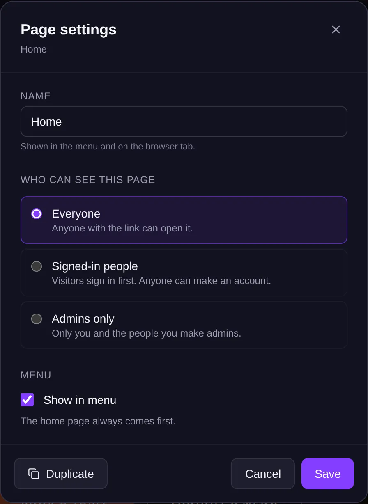
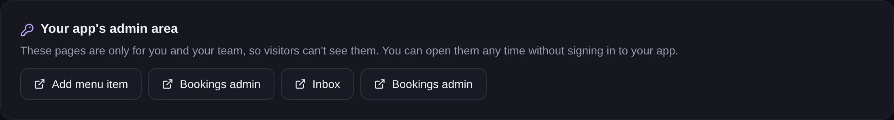

<!-- Generated from src/lib/help/guides.ts by `pnpm guides:build`. Edit that file, not this one. -->

# Members, sign-in and private pages

Let people make accounts in your app, and choose which pages everyone, signed-in members or only admins can open.

**On this page**

- [Sign-in pages](#sign-in-pages)
- [Make a page private](#make-a-page-private)
- [The menu](#the-menu)
- [Your app's admin area](#your-apps-admin-area)
- [Give your team an admin login](#give-your-team-an-admin-login)
- [Good to know](#good-to-know)

## Sign-in pages

The **Sign-in and accounts** feature gives your app **Log in**, **Sign up** and **Profile** pages, and the flows behind them. New apps usually have it already. If yours doesn't, add it from the Features tab.

People who sign up are members of your app. Their accounts are separate from your own Nullkode account.

## Make a page private

1. In the page editor, click the page name at the top to open **Your pages**.
2. Press the gear next to the page (**Page settings**).
3. Under **Who can see this page**, choose **Everyone**, **Signed-in people** (visitors sign in first; anyone can make an account) or **Admins only** (only you and the people you make admins).
4. Press **Save**.

*Page settings: choose who can open the page.*

## The menu

In **Page settings**, **Show in menu** puts a link to the page in your app's menu, and **Move up** and **Move down** set its place. The home page always comes first. A page that isn't in the menu can still be opened by anyone with its link, if they're allowed to see it.

## Your app's admin area

On your app's Overview, **Your app's admin area** lists the pages that are only for you and your team, like a list of bookings. Click one to open it without signing in to your app. Before you publish, they open in Preview.

## Give your team an admin login

1. On your app's Overview, find **Admin logins for your team**.
2. Type their **Email** and a **Password** of at least 10 characters.
3. Press **Add admin**. They can now sign in on your app's sign-in page and open its admin pages.

*Open your admin pages, or give someone an admin login.*

## Good to know

- Using the email of someone who already has an account in your app makes them an admin and changes their password.
- If a page is private but your app has no sign-in page yet, only you can open it. Page settings warns you.
- Changes to who can see a page are part of your draft. Publish to apply them.
- Members can delete their own account. Requests to delete show on the Data tab under **Privacy requests**.
- Members' passwords aren't in backups. After an import, members use Forgot password once.

## Related guides

- [Edit your pages](page-editor.md): Change words, pictures and layout by clicking and dragging, or ask the AI to do it for you.
- [Automate with flows](flows.md): Make things happen by themselves when someone uses your app, like saving a booking and emailing you, or run jobs on a schedule.
- [Forms and your data](forms-and-data.md): See, search, change and download everything your app saves, like messages, bookings and sign-ups.

[All guides](README.md)
