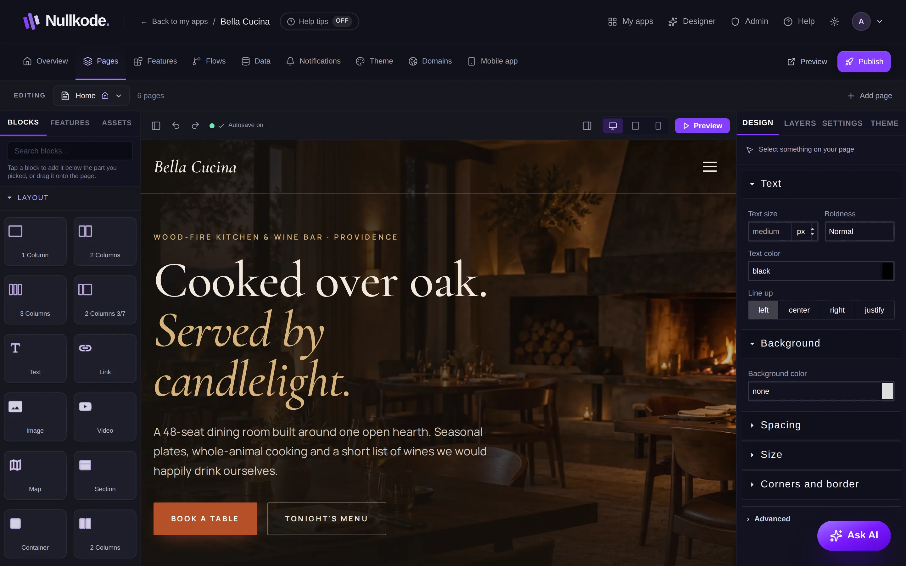
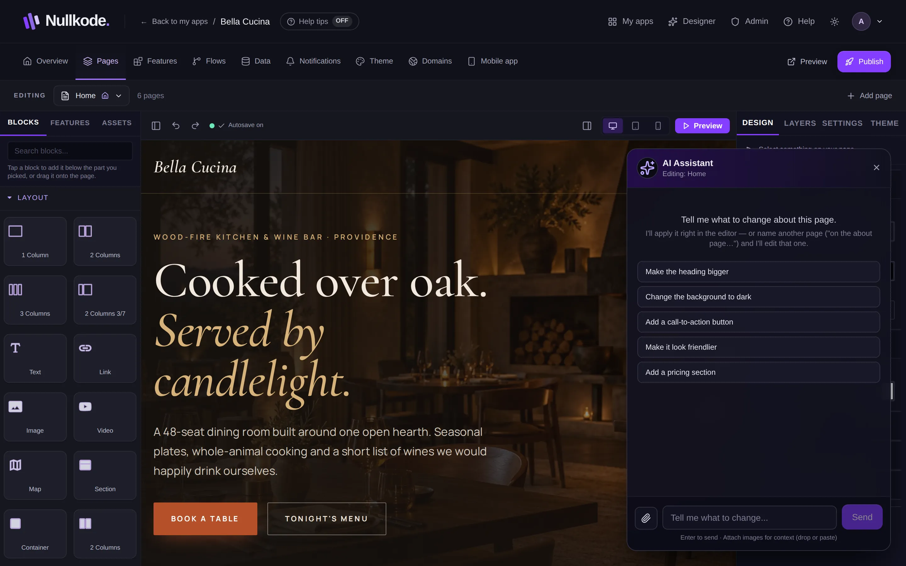

<!-- Generated from src/lib/help/guides.ts by `pnpm guides:build`. Edit that file, not this one. -->

# Edit your pages

Change words, pictures and layout by clicking and dragging, or ask the AI to do it for you.

**On this page**

- [Find your way around](#find-your-way-around)
- [Change words and pictures](#change-words-and-pictures)
- [Add blocks](#add-blocks)
- [Select, move and delete](#select-move-and-delete)
- [Change how things look](#change-how-things-look)
- [Settings for links, buttons, forms and lists](#settings-for-links-buttons-forms-and-lists)
- [Ask the AI](#ask-the-ai)
- [Your pages](#your-pages)
- [Check it on a phone, then preview](#check-it-on-a-phone-then-preview)
- [Undo and saving](#undo-and-saving)
- [Good to know](#good-to-know)

## Find your way around

Open the **Pages** tab. On the left are **Blocks**, **Features** and **Assets** (free photos). In the middle is your page. On the right are **Design**, **Layers**, **Settings** and **Theme**.

The bar above your page has undo and redo, whether your work is saved, the screen size buttons and **Preview**. The panel buttons at each end hide or show the side panels when you want more room.

*The page editor. Click anything on your page to change it.*

## Change words and pictures

Click any words on the page and type to change them.

Double-click a picture to swap it for another one. You can also pick a picture and then tap a photo in **Assets**. Double-click an icon to choose a different icon.

## Add blocks

1. Click the part of your page you want the new piece to go under.
2. In **Blocks** on the left, find what you want. Blocks are grouped, for example Layout, Sections, Content, Forms and Media. Type in **Search blocks...** to find one fast, like “button” or “photo”.
3. Tap the block to add it below the part you picked, or drag it to exactly where you want it.

## Select, move and delete

Click something on your page to select it. Its name shows at the top of the right-hand panel, and a small toolbar appears next to it: **Select the part around this**, **Move up**, **Move down**, **Drag to move**, **Duplicate** and **Delete**.

The **Layers** tab lists every piece of your page in order. Click a row to select a piece that's hard to click, or drag rows to move pieces. The eye icon hides a piece while you work on the rest.

## Change how things look

Select something and open **Design** on the right. Change its text, colours, spacing, size and corners, and the page updates straight away.

**Advanced** shows more options, like fonts, shadows and how pieces line up inside a box, plus styles for when the mouse is over something. For colours and fonts across your whole app, use **Theme**.

## Settings for links, buttons, forms and lists

Select a link, picture, button, form or list and open **Settings** on the right. For example:

- **Goes to** sets where a link takes people. Use /page-name for your own pages, or a full https:// address for another site.
- **Picture description** describes a picture for people who can't see it, and for search engines.
- **When sent, run** (on a form) picks the flow that runs when someone sends it. **When pressed, run** does the same for a button.
- **Show items from** (on a list) picks where the list gets its items, like your bookings or products.

## Ask the AI

1. Press **Ask AI** at the bottom right.
2. To change just one part, select it on the page first. The panel then says **Changes apply to the selected…**. Press **Whole page instead** to change the whole page.
3. Type what you want, like “add a pricing section”, and press Enter or **Send**. You can attach a picture too, like a screenshot of a design you like.
4. The page changes in the editor. If you don't like it, press undo.

*Ask AI: say what to change and it changes the page for you.*

## Your pages

Click the page name at the top, next to **EDITING**, to see **Your pages**. Click a page to open it. Your changes on the page you're leaving are saved first.

To add a page, press **Add page**, type its name and press **Add page** again. It shows up in your app's menu.

Next to each page: the gear opens **Page settings** (rename it, choose who can see it, its place in the menu, or **Duplicate** it), the house makes it your home page, and the bin deletes it after you confirm. Deleting a page can't be undone.

## Check it on a phone, then preview

The **Desktop**, **Tablet** and **Mobile** buttons show your page at each size. Always check Mobile: most visitors use phones.

**Preview** opens the page in a new tab so you can try it, with its buttons and forms working. It shows your latest changes. Visitors don't see them until you publish.

## Undo and saving

The curved arrows at the top left undo and redo your last changes, including changes the AI made.

Your changes save by themselves. The bar shows **Saving…** and then **Saved**. If it says **Not saved**, check your connection: it keeps trying, and **Retry** tries again straight away. If your changes didn't reach the server before you closed the tab, you'll be offered **Restore** the next time you open the page.

## Good to know

- Changes stay in your draft. Visitors see them after you publish.
- Apps made with the AI Designer get their pages from the design, so change them in the Designer.
- If a ready-made block asks **Wire this up?**, **Yes, connect it** sets up a place to keep what people send and connects the form. **No, I'll handle it** adds the block as it is.

## Related guides

- [Colours and fonts](look-and-feel.md): Pick a ready-made theme, or set your own colours, fonts and corners for every page of your app.
- [Add features](features.md): Add ready-made parts like bookings, a shop or a blog, complete with their own pages and saved data.
- [Members, sign-in and private pages](members-and-sign-in.md): Let people make accounts in your app, and choose which pages everyone, signed-in members or only admins can open.
- [Publish and share your app](publishing.md): Put your app online, share its link, update it safely and bring back an earlier version if you need to.

[All guides](README.md)
