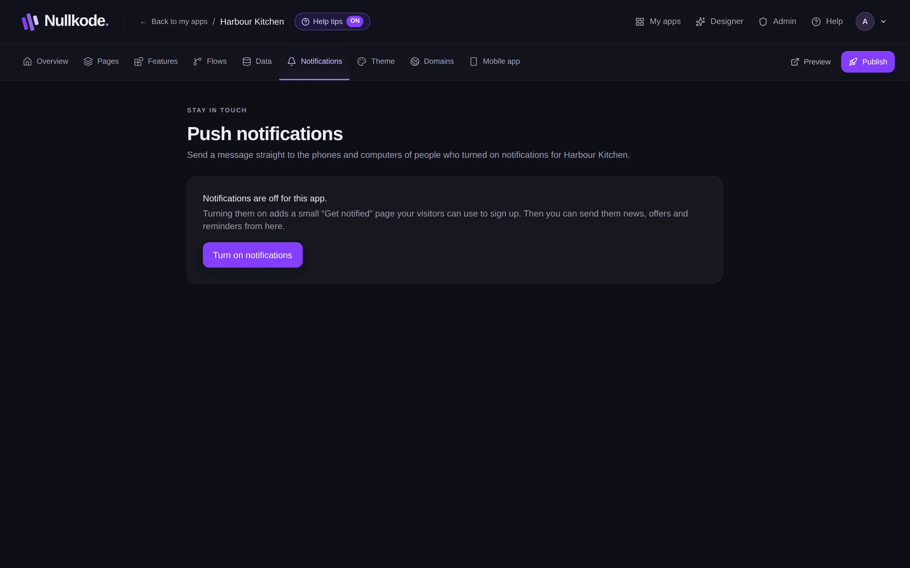
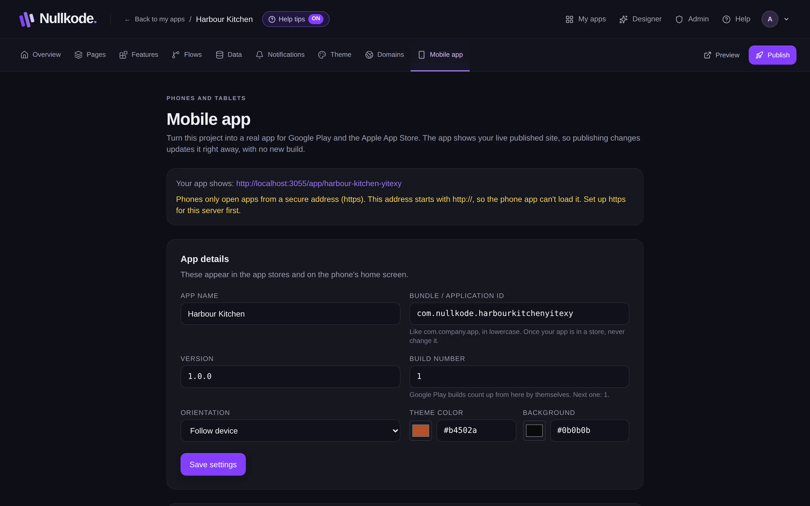

<!-- Generated from src/lib/help/guides.ts by `pnpm guides:build`. Edit that file, not this one. -->

# Phone apps and notifications

Put your app on people's home screens, send them notifications, and build Android and iPhone versions.

**On this page**

- [Add it to a home screen](#add-it-to-a-home-screen)
- [Send notifications](#send-notifications)
- [Who can get notifications](#who-can-get-notifications)
- [Build an Android app](#build-an-android-app)
- [Keep your upload key safe](#keep-your-upload-key-safe)
- [iPhone and iPad](#iphone-and-ipad)
- [Good to know](#good-to-know)

## Add it to a home screen

Every published app can be installed straight from the browser, with no app store. Open your app on the phone (scan the code on the Overview or the Publish tab), then choose **Add to Home Screen** in the browser's menu. On an iPhone it's under the Share button. It then opens like any other app, with your icon.

Set your app's icon on the Overview under **App icon**. You can upload a picture or have the AI make one.

## Send notifications

1. Open the **Notifications** tab.
2. If notifications are off, press **Turn on notifications**. This adds a small “Get notified” page your visitors use to sign up.
3. Publish your app so visitors can sign up.
4. Write a **Title** and a **Message**. You can add a page to open when the notification is tapped, like /menu.
5. Press **Send to** (it shows how many people will get it). **Sent** lists what you've sent and how many were delivered.

*Write a notification and send it to everyone who signed up.*

## Who can get notifications

On Android phones and computers, people turn on notifications from the browser. On iPhone and iPad, they first add your app to their home screen, then turn on notifications there.

Flows can send notifications too, with the **Send a notification** step.

## Build an Android app

The phone app shows your live, published app, so publishing changes updates it without a new build.

1. Publish your app first.
2. Open the **Mobile app** tab.
3. Under **App details**, check the **App name**, the **Bundle / Application ID** (like com.yourbusiness.app; never change it once your app is in a store), **Version**, **Orientation** and colours, then press **Save settings**.
4. Press **Build test APK** for a copy you can install straight on an Android phone to try it.
5. When you're ready for Google Play, press **Build for Google Play**. **Put your app on Google Play** walks you through the store's steps.

*Build a test copy, or the file Google Play asks for.*

## Keep your upload key safe

Google Play knows your app by its upload key, a secret file made the first time you build for Google Play. Press **Download key backup** and keep it somewhere private, like a password manager. Without it you can never update your app on Google Play again. Only the app's owner can download it.

## iPhone and iPad

Press **Download iPhone project** on the Mobile app tab. Building an iPhone app needs a paid Apple Developer account and either a Mac or a free GitHub account; the instructions inside the download explain both, step by step.

## Good to know

- **Phone features this app uses** lists what your app asks the phone for, like the camera or location. When that list changes, build again and send the stores the new version.
- Phones only open apps from a secure address (https). The Mobile app tab warns you if yours isn't.
- If it says **Android builds are turned off on this server**, ask whoever runs Nullkode for you.
- Before deleting an app or your account, download its Google Play upload key.

## Related guides

- [Publish and share your app](publishing.md): Put your app online, share its link, update it safely and bring back an earlier version if you need to.
- [Use your own domain](custom-domains.md): Put your app on a web address you own, like www.yourbusiness.com.

[All guides](README.md)
