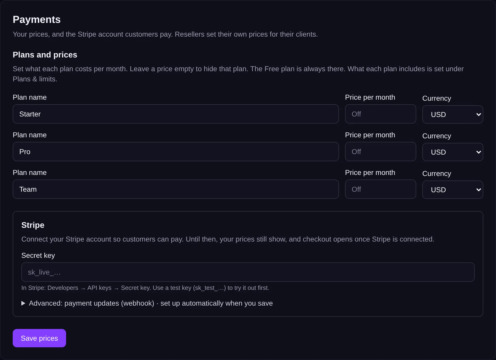
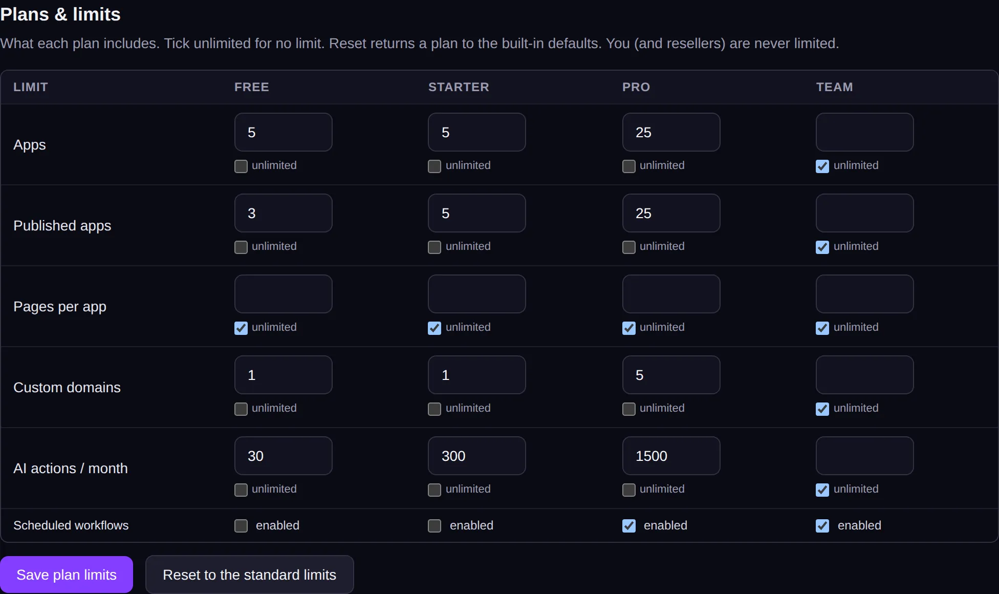

<!-- Generated from src/lib/help/guides.ts by `pnpm guides:build`. Edit that file, not this one. -->

# Prices and payments

Connect Stripe, and set what each plan costs and includes, so customers pay you directly.

*For the platform's operator (admin) and for resellers.*

**On this page**

- [Where to find it](#where-to-find-it)
- [Connect Stripe](#connect-stripe)
- [Set your prices](#set-your-prices)
- [Decide what each plan includes](#decide-what-each-plan-includes)
- [What customers see](#what-customers-see)
- [Good to know](#good-to-know)

## Where to find it

**If you run the platform:** Admin, **All settings**, then **Payments** for prices and Stripe, and **Plans & limits** for what each plan includes.

**If you're a reseller:** your Reseller dashboard, **Billing & plans**. It has **1. Your prices** and **2. What each plan includes**.

Payments go through Stripe, an online payment service. You need your own Stripe account.

## Connect Stripe

1. In Stripe, go to Developers, API keys, and copy the **Secret key**. To try things out first, use a test key (it starts sk_test_).
2. Paste it into **Secret key** under **Stripe**.
3. Press **Save prices**. Nullkode sets up the payment updates from Stripe for you.

## Set your prices

1. Under **Plans and prices**, each paid plan has a **Plan name**, a **Price per month** and a **Currency**.
2. Type a price for each plan you want to offer. Leave a price empty to hide that plan. The Free plan is always there.
3. Press **Save prices**. The prices are created in your Stripe account for you.

*Name and price each plan, and connect Stripe.*

## Decide what each plan includes

For each plan, set the number of **Apps**, **Published apps**, **Pages per app**, **Custom domains** and **AI actions / month**, and whether **Scheduled workflows** are included.

On the operator's **Plans & limits**, tick **unlimited** for no limit, then press **Save plan limits**. On a reseller's **Billing & plans**, leave a box empty for unlimited and press **Save plans**.

Resellers can also untick **Let new clients sign themselves up on your domain** to make accounts invitation-only.

*What each plan includes.*

## What customers see

Customers see the plans you offer on their **Billing & plan** page, with an **Upgrade** button that takes them to Stripe to pay. Paying customers get **Manage billing** to change their card or cancel. Until Stripe is connected, your prices still show, and checkout works once it's connected.

You can also change someone's plan by hand: the operator from the Users list, a reseller from the client list.

## Good to know

- Customers pay you directly, on your own Stripe account. The platform takes no fee.
- If Stripe's payment updates ever fail to set up, **Advanced: payment updates (webhook)** shows the address to add in Stripe by hand.
- Try everything with a Stripe test key before you switch to your live key.

## Related guides

- [Resellers and clients](resellers.md): Sell app building under another brand: the operator adds resellers, and each reseller invites and looks after their own clients.
- [Your brand (white-label)](white-label.md): Put your own name, logo and colours on the studio, its emails and its sign-in pages.
- [Running your platform](running-your-platform.md): Your admin home: set up Nullkode, look after the people using it, and keep the server healthy.

[All guides](README.md)
