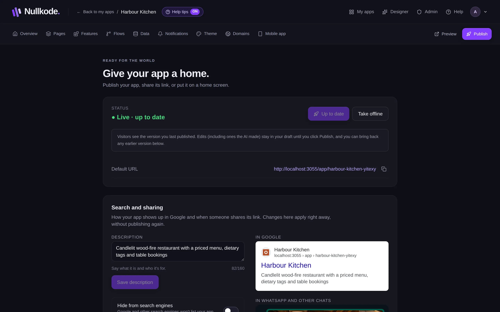
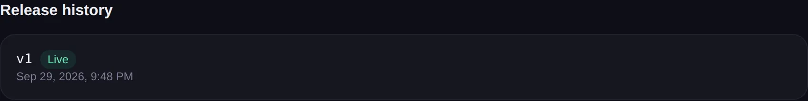

<!-- Generated from src/lib/help/guides.ts by `pnpm guides:build`. Edit that file, not this one. -->

# Publish and share your app

Put your app online, share its link, update it safely and bring back an earlier version if you need to.

**On this page**

- [Draft and live](#draft-and-live)
- [Publish for the first time](#publish-for-the-first-time)
- [Share the link](#share-the-link)
- [Publish your changes](#publish-your-changes)
- [Go back to an earlier version](#go-back-to-an-earlier-version)
- [Take it offline](#take-it-offline)
- [Back up or move your app](#back-up-or-move-your-app)
- [Install it on computers and phones](#install-it-on-computers-and-phones)
- [Good to know](#good-to-know)

## Draft and live

You always work on a draft. Visitors see the version you last published. Your changes, including the AI's, stay in the draft until you publish again, so nobody sees half-finished pages.

## Publish for the first time

1. Press **Publish** at the top right of your app's tabs.
2. Press **Publish app**.
3. You'll see **Your app is live. Ready to share.** and the status changes to **Live**.

*Publish, and copy your app's link to share it.*

## Share the link

Your app's web address is on the Publish tab, with a button to copy it. On the Overview there's a code you can scan with your phone's camera to open it.

**Search and sharing** sets the description search engines and chat apps show with your link. Turn on **Hide from search engines** if you don't want your app listed on Google; anyone with the link can still open it.

## Publish your changes

When you've changed something since publishing, the status says **Live · you have unpublished changes**. Press **Publish changes** to make them live. When there's nothing new, the button says **Up to date**.

Want to try your changes first? **Preview**, at the top right, opens your draft in a new tab. Only you can open it.

## Go back to an earlier version

Every time you publish, the version is kept under **Release history**, newest first, with the live one marked **Live**.

1. Find the version you want under **Release history**.
2. Press **Make live** and confirm.
3. Visitors see that version straight away. Your draft isn't changed, so you can fix things and publish again.

*Release history: bring back any recent version.*

## Take it offline

**Take offline** stops visitors opening your app until you publish again. Nothing is deleted.

## Back up or move your app

**Download backup (.zip)** saves one file with every page, flow, table and row, your theme and your pictures. Keep it somewhere safe, or bring it back with **Import an app** when you start a new app, here or on another Nullkode server. Members' passwords aren't included.

## Install it on computers and phones

Under **Install on devices**: **Download offline app (.zip)** gives a copy that works on one computer without the internet, keeping its data on that computer. **Desktop shortcut (online)** puts a shortcut to your live app on a Windows or Mac desktop. For phones, see the guide Phone apps and notifications.

## Good to know

- Your plan may limit how many apps you can have published at once.
- Release history shows your 20 most recent versions.
- Scheduled flows only run once your app is published.
- You can connect your own web address on the Domains tab.

## Related guides

- [Use your own domain](custom-domains.md): Put your app on a web address you own, like www.yourbusiness.com.
- [Phone apps and notifications](phone-apps.md): Put your app on people's home screens, send them notifications, and build Android and iPhone versions.
- [Getting started](getting-started.md): Find your way around Nullkode and make your first app, whichever way suits you.

[All guides](README.md)
