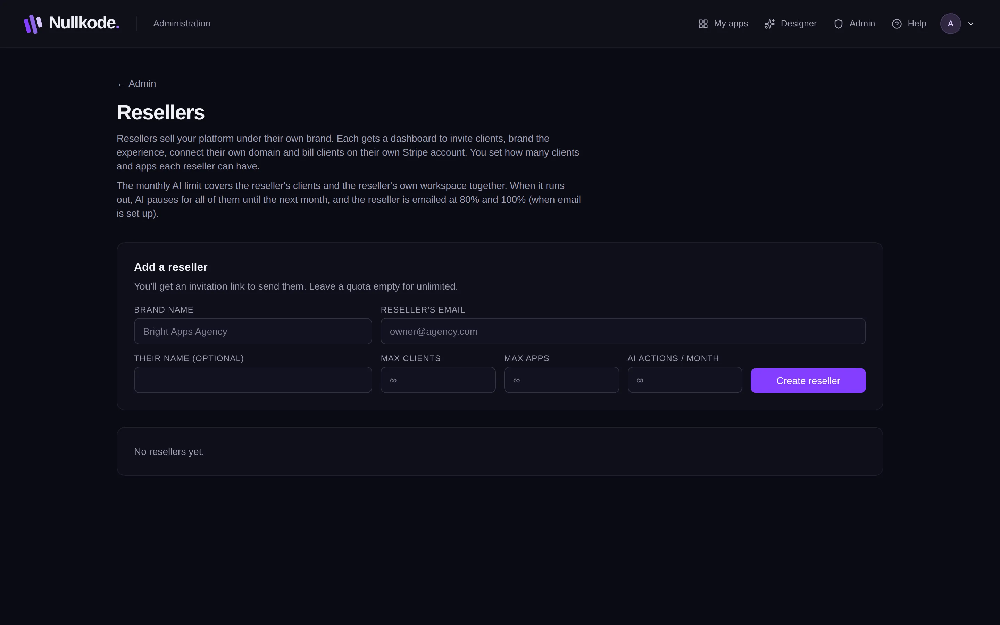

<!-- Generated from src/lib/help/guides.ts by `pnpm guides:build`. Edit that file, not this one. -->

# Resellers and clients

Sell app building under another brand: the operator adds resellers, and each reseller invites and looks after their own clients.

*For the platform's operator (admin) and for resellers.*

**On this page**

- [How it fits together](#how-it-fits-together)
- [Operators: add a reseller](#operators-add-a-reseller)
- [Operators: look after resellers](#operators-look-after-resellers)
- [Resellers: your dashboard](#resellers-your-dashboard)
- [Resellers: invite clients](#resellers-invite-clients)
- [Resellers: help a client](#resellers-help-a-client)
- [Resellers: client apps](#resellers-client-apps)
- [Good to know](#good-to-know)

## How it fits together

- **The operator** runs the platform and sets the plans, prices and limits.
- **Resellers** are agencies the operator adds. Each has its own brand, address, Stripe account and clients.
- **Clients** are the reseller's customers. They build apps and only ever see the reseller's brand.
- **App users** are the people who use the published apps.
- Clients pay the reseller directly. The platform takes no cut.

## Operators: add a reseller

1. In Admin, open **Resellers**.
2. Under **Add a reseller**, type the **Brand name**, the **Reseller's email** and, if you like, **Their name**.
3. Set **Max clients**, **Max apps** and **AI actions / month**, or leave them empty for unlimited.
4. Press **Create reseller**. They get an invitation email if email is set up; otherwise you get a link to send them.

*Add resellers and set their limits.*

## Operators: look after resellers

The table shows each reseller's clients, apps, AI actions this month, domain and status. Click a number like 3 / 10 to change that limit. The buttons at the end of a row let you sign in as the reseller, make an invitation or password reset link, suspend or reactivate them, and delete them.

The monthly AI limit covers the reseller and all their clients together. When it runs out, the AI pauses for all of them until next month. The reseller is emailed at 80% and 100%, if email is set up.

Suspending a reseller signs out the reseller and all their clients. Deleting one asks you to type its name; its clients keep their accounts and apps and become your direct customers on the Free plan.

## Resellers: your dashboard

Click **Reseller dashboard** in the top bar. **Overview** has a **Get set up** checklist (logo and colours, your own domain, payments, your first client) and how many clients, apps and AI actions you're using. The menu on the left has **Clients**, **Apps**, **Branding**, **Domain** and **Billing & plans**.

## Resellers: invite clients

1. Open **Clients**.
2. Under **Invite a client**, type their **Email**, their **Name** if you like, and choose their **Plan**.
3. Press **Send invite**. They get an email with a link to set their password, or you get the link to send if email isn't set up.
4. To invite lots of people, press **Invite several at once** and paste up to 50 email addresses.

## Resellers: help a client

The client list shows each client's status, plan, apps, AI use and when they were last active. Filter it by status, plan and payment, or tick **Not seen in 30 days** or **Never signed in**. **Needs attention** points out clients who may need a nudge.

Change a client's plan from the menu in their row. The buttons in each row let you **Open their workspace** (press **Back to your clients** to return), send a new invitation or password reset link, suspend or restore their access, and delete them.

Deleting a client deletes all their apps. You'll be asked to type their email to confirm.

## Resellers: client apps

**Apps** lists every app your clients have made. Press **Open** to edit one in the client's workspace. Apps you built yourself have **Give to client**, which moves the app to a client's workspace; you can still open it for them.

## Good to know

- A reseller only sees their own clients, never the operator's other customers or settings.
- Clients sign in at the reseller's address and see only the reseller's brand.
- When you've used all your client seats, invitations stop until the operator adds more.

## Related guides

- [Your brand (white-label)](white-label.md): Put your own name, logo and colours on the studio, its emails and its sign-in pages.
- [Prices and payments](prices-and-payments.md): Connect Stripe, and set what each plan costs and includes, so customers pay you directly.
- [Running your platform](running-your-platform.md): Your admin home: set up Nullkode, look after the people using it, and keep the server healthy.

[All guides](README.md)
