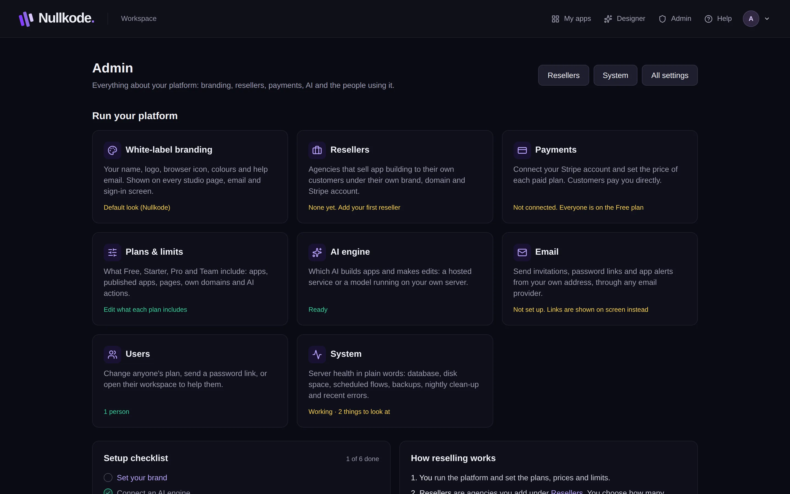
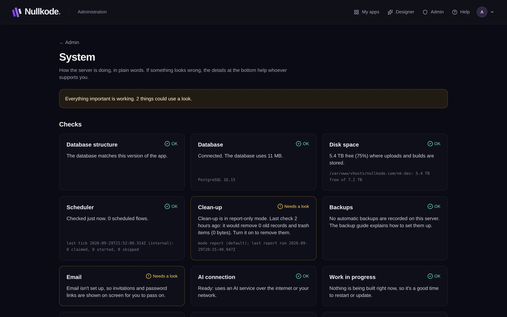

<!-- Generated from src/lib/help/guides.ts by `pnpm guides:build`. Edit that file, not this one. -->

# Running your platform

Your admin home: set up Nullkode, look after the people using it, and keep the server healthy.

*For the platform's operator (admin).*

**On this page**

- [The Admin home](#the-admin-home)
- [Setup checklist](#setup-checklist)
- [What each plan includes](#what-each-plan-includes)
- [Help the people using it](#help-the-people-using-it)
- [Keep an eye on things](#keep-an-eye-on-things)
- [Server health](#server-health)
- [Good to know](#good-to-know)

## The Admin home

Click **Admin** in the top bar. **Run your platform** has a card for each area, with how it stands now: **White-label branding**, **Resellers**, **Payments**, **Plans & limits**, **AI engine**, **Email**, **Users** and **System**. Click a card to open it. **All settings** at the top opens every setting on one page.

*The Admin home: every area of the platform, and what still needs doing.*

## Setup checklist

The **Setup checklist** ticks itself off as you go. Click a step to open its setting.

1. **Set your brand**: your name, logo and colours. See Your brand (white-label).
2. **Connect an AI engine**, so people can build by describing their app. See AI settings.
3. **Connect Stripe and price your plans**, if you charge. See Prices and payments.
4. **Turn on email**, so invitations, password links and alerts are sent for you. See Email.
5. **Give published apps their own address**. This is a server setting (APPS_DOMAIN in the .env file), not on this screen; the installer can set it. With a wildcard DNS record, every published app gets its own address, kept apart from the studio.
6. **Invite your first reseller**, if you sell through agencies. See Resellers and clients.

## What each plan includes

Under **All settings**, **Plans & limits** sets what Free, Starter, Pro and Team include: **Apps**, **Published apps**, **Pages per app**, **Custom domains**, **AI actions / month** and **Scheduled workflows**. Tick **unlimited** for no limit, then press **Save plan limits**. **Reset to the standard limits** puts back the built-in values. You and your resellers are never limited.

## Help the people using it

The **Users** list on the Admin home shows everyone who signed up. For each person you can:

- Change their plan from the menu. It saves straight away.
- Press **Password link** to make a sign-in link that works once, for 2 hours. It's emailed to them if email is on, or copied for you to send.
- Press **Impersonate** to open their workspace and help them. A banner shows while you're inside, and anything you change happens in their account. Press **Stop impersonating** to come back.
- Press **Delete** to delete their account. You'll see what goes with it and type their email to confirm.

## Keep an eye on things

**New people, last 30 days** shows how many people signed up, made an app and published one. **Recent projects** lists the latest apps, with **Jump in** to open one in its owner's workspace. **Recent flow runs** shows the latest automations and whether they worked.

## Server health

Open **System** for the server's health in plain words. Each check is a card: green is fine, amber could use a look, red needs attention now. It covers the database, disk space, scheduled flows, backups, email, the AI connection, memory and more.

**Nightly clean-up** removes old run logs, expired sign-ins, old published versions and the files of deleted apps. Choose **Report only** (count, delete nothing), **Remove old records** or **Off**, and press **Save**. **Check now** or **Run clean-up now** runs it straight away. Take a backup before you first turn on removing: deleted records can't be brought back.

If something goes wrong, **Details for support** copies or downloads a summary with private details hidden, ready to send to whoever supports you.

*System: how the server is doing, in plain words.*

## Good to know

- If the database needs an update after you upgrade, a banner at the top of the Admin home says so, and System explains what to do.
- Installs made with the standard installer back themselves up every night. Copy the backups to another device now and then.
- Monitoring tools can check /api/health to see that the server is up.
- The operator's runbook in the download (docs/operations.md) covers the details.

## Related guides

- [Your brand (white-label)](white-label.md): Put your own name, logo and colours on the studio, its emails and its sign-in pages.
- [Resellers and clients](resellers.md): Sell app building under another brand: the operator adds resellers, and each reseller invites and looks after their own clients.
- [Prices and payments](prices-and-payments.md): Connect Stripe, and set what each plan costs and includes, so customers pay you directly.
- [AI settings](ai-settings.md): Choose the AI engine that plans, builds and changes apps, and check that it works.
- [Email](email.md): Send invitations, password links, app alerts and your apps' own emails from your own address.

[All guides](README.md)
