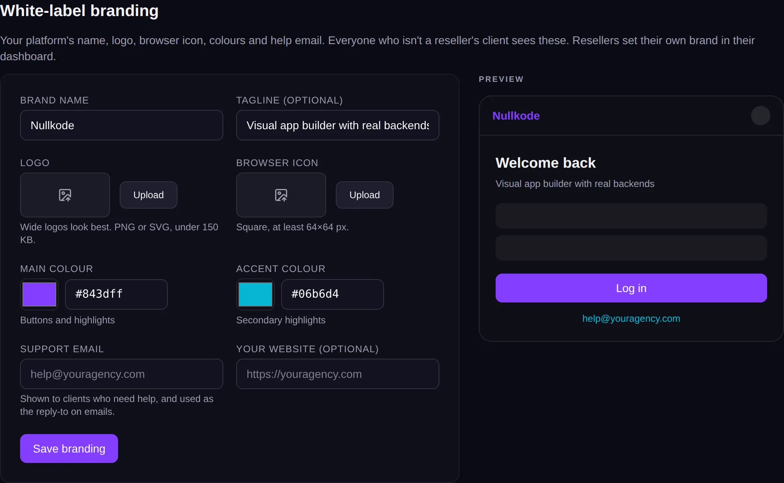

<!-- Generated from src/lib/help/guides.ts by `pnpm guides:build`. Edit that file, not this one. -->

# Your brand (white-label)

Put your own name, logo and colours on the studio, its emails and its sign-in pages.

*For the platform's operator (admin) and for resellers.*

**On this page**

- [Whose brand people see](#whose-brand-people-see)
- [Set your brand](#set-your-brand)
- [Resellers: use your own address](#resellers-use-your-own-address)
- [Good to know](#good-to-know)

## Whose brand people see

The platform's operator sets the brand everyone sees by default. Each reseller sets their own brand, and their clients only ever see that one, never the platform's.

**If you run the platform:** go to Admin, **All settings**, **Branding**.

**If you're a reseller:** open your **Reseller dashboard** and choose **Branding**.

## Set your brand

1. Type your **Brand name**. It's shown at the top of every screen, in emails and on the sign-in page.
2. Add a **Tagline (optional)**, a short line about what you offer. It's added to the browser tab's title.
3. Upload a **Logo**. Wide logos look best; use PNG or SVG, under 150 KB. It's shown instead of the brand name.
4. Upload a **Browser icon**: square, at least 64 by 64 pixels.
5. Pick a **Main colour** (buttons and highlights) and an **Accent colour** (smaller touches).
6. Add a **Support email**. It's shown to people who need help and used as the reply-to address on emails. Add **Your website** if you like.
7. Check the **Preview** of the sign-in screen, then press **Save branding**.

*Your brand, with a live preview of the sign-in screen.*

## Resellers: use your own address

Your clients can sign in and build at an address you own, like apps.youragency.com. Their published apps are shared from it too.

1. In your Reseller dashboard, open **Domain**.
2. Type a subdomain you control, like apps.youragency.com, and press **Use this domain**.
3. Add the two records shown (a CNAME or A record, and a TXT record) where you manage your domain's DNS.
4. Press **Check now**. When it says **Connected**, your clients can sign in there.

## Good to know

- Changes show the next time a page loads.
- Images over 150 KB are refused. Export a smaller version and try again.
- A reseller's address gets a secure (https) certificate by itself on servers set up for it. If it doesn't open securely, ask the platform's operator.
- To stop using a reseller address, clear the box and save.
- Operators: give published apps a neutral address (APPS_DOMAIN) so reseller clients' app links don't show the platform's name.

## Related guides

- [Resellers and clients](resellers.md): Sell app building under another brand: the operator adds resellers, and each reseller invites and looks after their own clients.
- [Prices and payments](prices-and-payments.md): Connect Stripe, and set what each plan costs and includes, so customers pay you directly.
- [Email](email.md): Send invitations, password links, app alerts and your apps' own emails from your own address.

[All guides](README.md)
